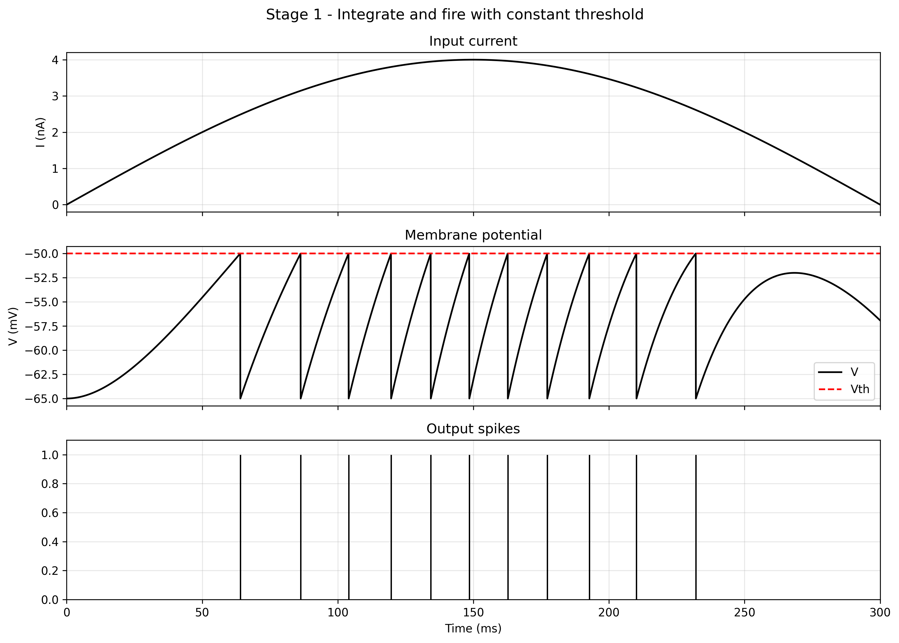
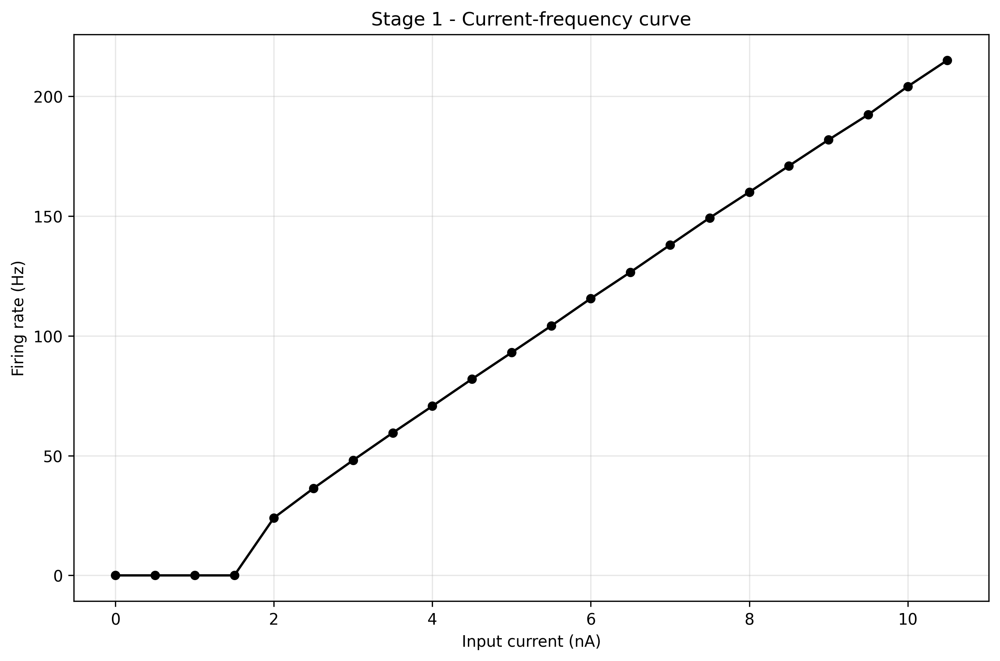
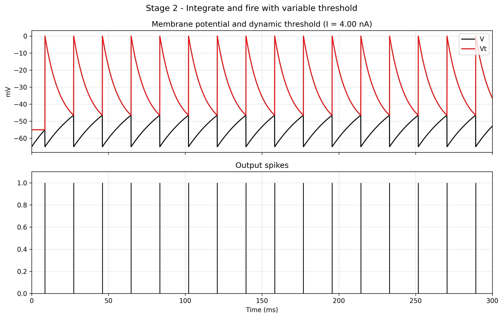
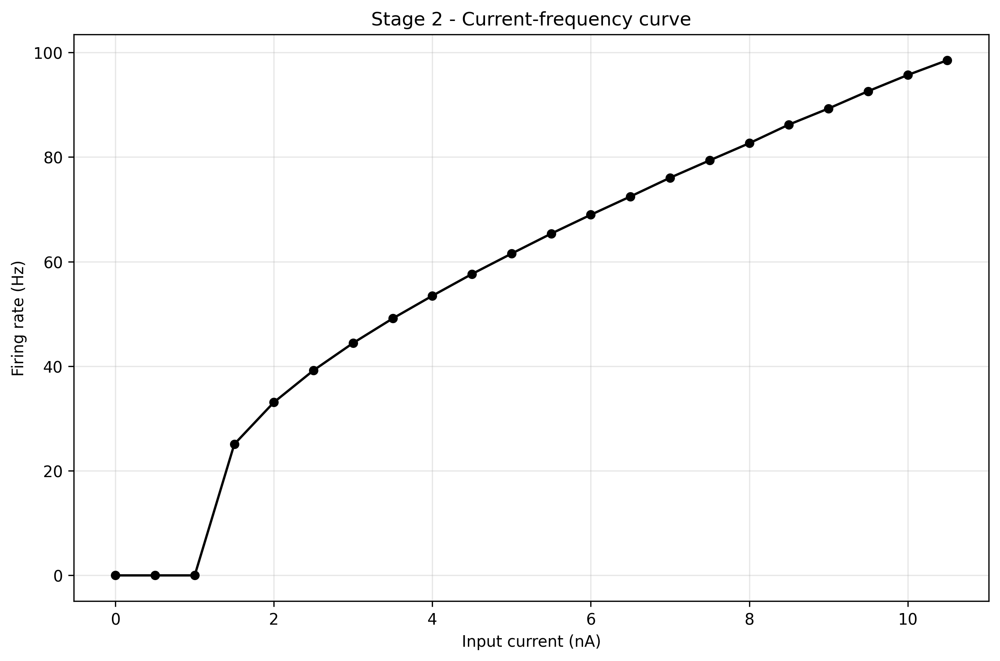

# Integrate-and-Fire Model Report

## Overview
This module studies the classical integrate-and-fire neuron model in two progressively richer versions:

- Stage 1: leaky integrate-and-fire neuron with a fixed threshold
- Stage 2: leaky integrate-and-fire neuron with a dynamic threshold, used to represent relative refractoriness

The main goal is to understand how the neuron converts input current into spike trains and how threshold dynamics change firing behavior, spike timing, and excitability.

---

## Objective
The purpose of this study is to analyze the response of a simplified spiking neuron model under external stimulation.

The analysis focuses on:

- membrane-potential dynamics below threshold,
- spike generation through threshold crossing and reset,
- the role of a fixed threshold versus a time-varying threshold,
- the current-frequency relationship of the neuron.

In other words, this work shows how a simple leaky membrane becomes a spiking model and how adding threshold recovery improves temporal realism.

---

## Theoretical Background
The integrate-and-fire model is based on a simplified membrane description.

Below threshold, the neuron behaves like a leaky RC circuit: membrane potential integrates input current while leaking toward resting potential. When membrane potential reaches threshold, the model emits a spike event and resets voltage instead of simulating full ionic spike dynamics.

A limitation of the simplest version is that under strong current the model may fire unrealistically fast. This can be improved by introducing refractoriness through a dynamic threshold that jumps after each spike and relaxes gradually back to baseline. Stage 2 implements this mechanism.

---

## Model Description

## Stage 1 - Fixed-Threshold Integrate-and-Fire
The first stage follows:

`tau_m * dV/dt = -(V - E0) + r * I`

with steady-state form:

`Vinf = E0 + r * I`

where:

- `E0` is resting potential,
- `r` is membrane resistance,
- `I` is external current,
- `tau_m` is membrane time constant.

When `V >= Vth`, a spike is generated and voltage is reset to `E0`.

---

## Stage 2 - Dynamic-Threshold Integrate-and-Fire
In the second stage, threshold is dynamic:

`tau_t * dVt/dt = -(Vt - VtL)`

where:

- `VtL` is baseline threshold,
- `VtH` is elevated threshold immediately after spike,
- `tau_t` is threshold recovery time constant.

Rule:

- when `V >= Vt`, spike is generated,
- membrane is reset,
- threshold jumps to `VtH`,
- threshold relaxes exponentially toward `VtL`.

This introduces relative refractoriness, making immediate re-firing less likely.

---

## Parameters
Values used in this report:

- `E0 = -65 mV`
- `r = 10 MOhm`
- `tau_m = 30 ms`
- fixed-threshold stage: `Vth = -50 mV`
- dynamic-threshold stage:
  - `VtL = -55 mV`
  - `VtH = 0 mV`
  - `tau_t = 10 ms`
- `dt = 0.05 ms`
- `tend = 300 ms`

These settings produce stable simulations and clear comparison between stages.

---

## Numerical Simulation
Membrane dynamics are simulated in discrete time.

For sub-threshold voltage updates, the implementation uses the exact exponential step of the first-order system (for piecewise constant input over each time step), which is more stable and accurate than a simple Euler step for this model.

Whenever threshold is crossed, spike/reset rules are applied according to the stage.

---

## Results

## Figure 1 - Stage 1 Dynamics
This figure shows the fixed-threshold neuron under input stimulation, including:

- input current,
- membrane potential,
- spike train.

It highlights the core integrate-threshold-reset cycle.



---

## Figure 2 - Stage 1 Current-Frequency Curve
This figure shows firing frequency as input current increases.

The curve confirms a key property of integrate-and-fire neurons: once input exceeds effective threshold, firing begins and rate increases with current.



---

## Figure 3 - Stage 2 Dynamics
This figure shows membrane potential, dynamic threshold, and spike train with threshold recovery.

After each spike, threshold elevation temporarily reduces excitability and then relaxes, preventing immediate re-firing and yielding more realistic timing under sustained input.



---

## Figure 4 - Stage 2 Current-Frequency Curve
This figure shows the current-frequency relation for the dynamic-threshold model.

The global trend remains increasing, but dynamic thresholding modulates effective excitability and can reduce firing rate relative to fixed-threshold dynamics at stronger drive.



---

## Interpretation
The two stages illustrate a clear model progression.

Stage 1:

- minimal spiking model,
- simple and interpretable,
- captures baseline current-to-spike conversion.

Stage 2:

- adds one internal state (`Vt`),
- introduces relative refractoriness,
- improves temporal realism with minimal complexity increase.

This progression preserves model simplicity while improving biological plausibility.

---

## Conclusion
The integrate-and-fire framework is built here in two steps:

- fixed-threshold model for baseline spike generation,
- dynamic-threshold model for refractory timing control.

The second stage demonstrates how a small extension in state dynamics significantly improves spike-timing realism while preserving computational efficiency and interpretability.

---

## Reproducibility
Run:

```bash
python 01_integrate_and_fire/integrate_and_fire.py
```
