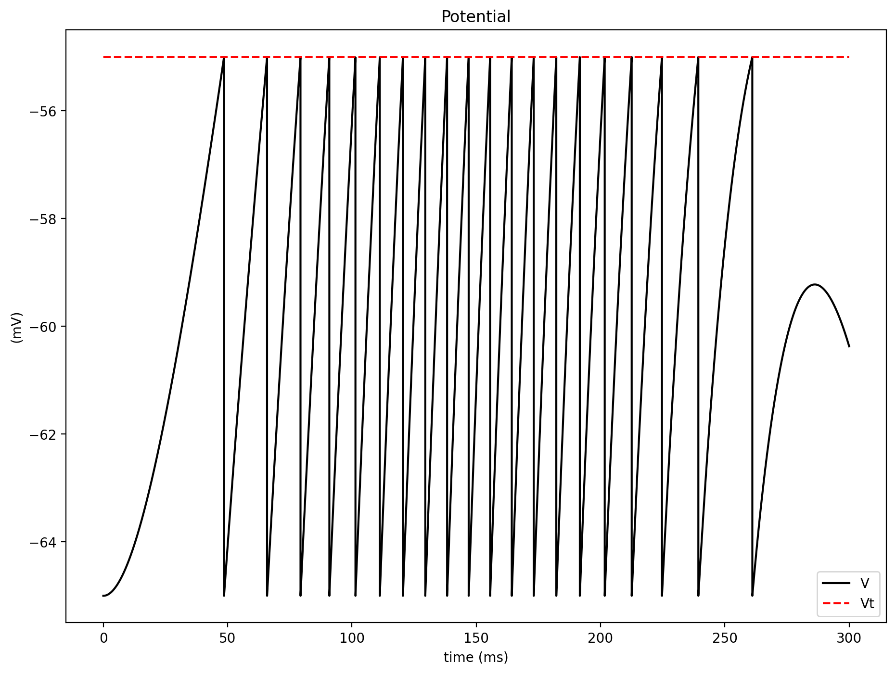
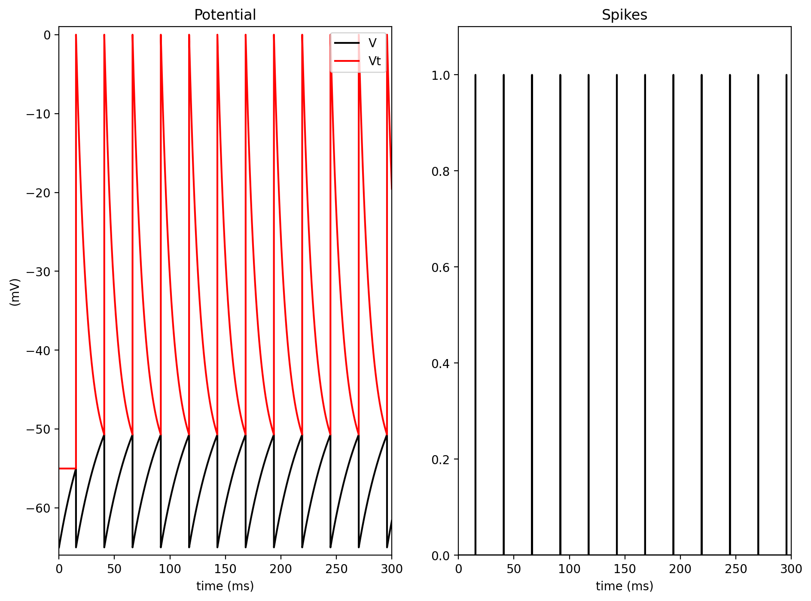

# Integrate-and-Fire Report (Stages 1 and 2)

## Stage 1: Constant Threshold Integrate-and-Fire

### Objective
Simulate a single integrate-and-fire neuron with fixed threshold and analyze:
1. Time response to a variable input current.
2. Discharge frequency as a function of constant input current (I-F curve).

### Model
Membrane dynamics:

tau_m * dV/dt = -(V - E0) + r * I(t)

Discrete update used in code (variable current case, Euler):

```text
Vinf = E0 + r*I[k]
V[k+1] = V[k] + (Vinf - V[k]) * dt / tau
```

Discrete update used in code (constant current trials, exact step):

```text
Vinf = E0 + r*I
V[k+1] = (V[k] - Vinf) * exp(-dt/tau) + Vinf
```

Spike rule:
- If V[k+1] > Vt, emit a spike and reset V[k+1] = E0.

Used parameters (from the provided code):
- E0 = Vreset = -65 mV
- Vt = -55 mV
- tau = 30 ms
- r = 10 Mohm

### Results
Input current \(I(t)\) was chosen as a rectified sinusoid.


Membrane potential follows the input and resets at each threshold crossing.



Binary spike train generated by threshold crossings:


Frequency-current behavior (constant currents from 0 to 10.5 nA):


Interpretation:
- For low current, spiking is absent or rare.
- Increasing current increases firing rate, giving the expected monotonic I-F relationship for a basic LIF neuron.

## Stage 2: Variable Threshold (Relative Refractory Effect)

### Objective
Extend Stage 1 by making threshold dynamic to model relative refractoriness, then evaluate:
1. Response to one constant input current.
2. I-F curve across a range of constant currents.

### Model
Membrane dynamics:

tau_m * dV/dt = -(V - E0) + r * I

Threshold dynamics:

tau_t * dVt/dt = -(Vt - VtL)

Discrete updates used in code:

```text
Vinf = E0 + r*I
V[k+1]  = (V[k]  - Vinf) * exp(-dt/tau)  + Vinf
Vt[k+1] = (Vt[k] - VtL)  * exp(-dt/taut) + VtL
```

Spike rule:
- If V[k+1] > Vt[k+1], emit spike, reset V[k+1] = E0, and set Vt[k+1] = VtH.

Used parameters:
- E0 = -65 mV
- VtL = -55 mV
- VtH = 0 mV
- tau = 30 ms
- taut = 10 ms
- r = 10 Mohm

### Results
Example response for one constant current:



Here, the threshold rises after each spike and then decays back to VtL, which temporarily reduces excitability (relative refractory period).

Frequency-current curve:


Interpretation:
- The neuron still shows increasing firing rate with current.
- Compared with fixed threshold, dynamic threshold introduces adaptation-like behavior by spacing spikes more after each reset.

## Conclusion
Stage 1 demonstrates the standard LIF mechanism with fixed threshold and monotonic I-F response.  
Stage 2 adds a dynamic threshold that captures relative refractory effects, producing a more physiologically realistic spiking pattern while preserving the overall increase of frequency with input current.

