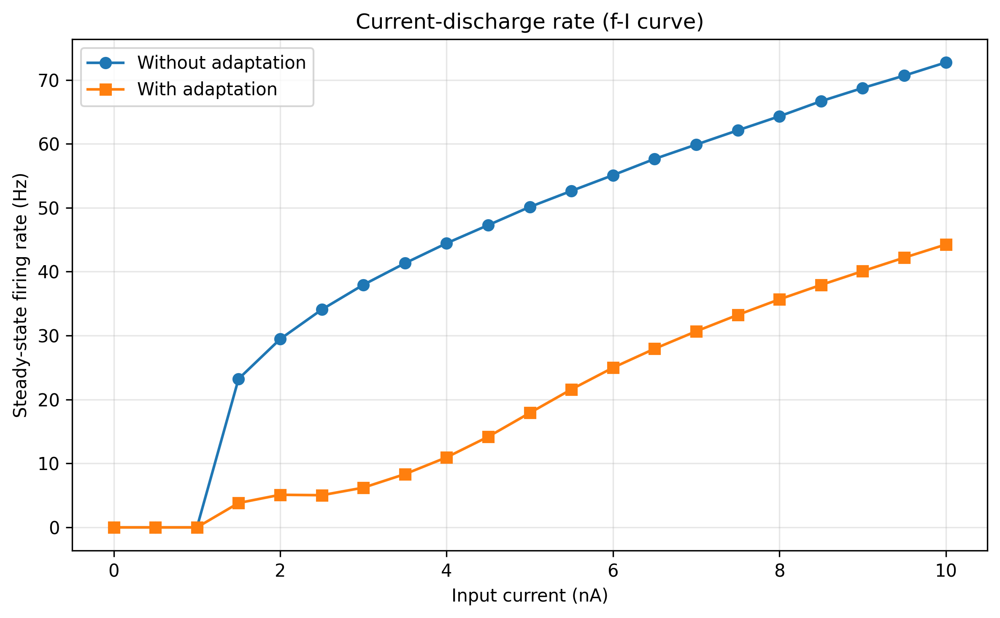

# Adaptive Neuron Report

## Overview
This module models a leaky integrate-and-fire neuron with:

- a dynamic threshold `Vt` (refractory behavior),
- an optional spike-triggered adaptation conductance `ga`.

The analysis compares neuron behavior with and without adaptation under constant current, then evaluates the current-discharge relationship (f-I curve).

## Objective
The goal is to quantify how adaptation changes excitability and spike timing.

The code evaluates:

- membrane and threshold dynamics,
- adaptation-state dynamics,
- spike timing differences between adapting and non-adapting cases,
- steady-state firing rate as a function of input current.

## Model Equations
At each step, the effective membrane terms are:

`ga = gamax * Pa` (when adaptation is enabled)

`geq = gL + ga`

`Eeq = (gL*E0 + ga*Ea) / geq`

`req = 1 / geq`

`Vinf = Eeq + req*I`

`tau_eff = C*req`

State updates:

`V[k+1] = Vinf + (V[k] - Vinf) * exp(-dt/tau_eff)`

`Vt[k+1] = Vtl + (Vt[k] - Vtl) * exp(-dt/taut)`

`Pa[k+1] = Pa[k] * exp(-dt/taua)`

Spike/reset event:

- if `V[k+1] >= Vt[k+1]`, then `V[k+1] = E0`, `Vt[k+1] = Vth`,
- with adaptation enabled: `Pa[k+1] = Pa[k+1] + dPa*(1 - Pa[k+1])`.

## Parameter Set Used
- `E0 = -65 mV`
- `r = 10 MOhm`
- `taum = 30 ms`
- `Vtl = -55 mV`
- `Vth = 50 mV`
- `taut = 10 ms`
- `Ea = -90 mV`
- `taua = 700 ms`
- `dPa = 0.10`
- `rgamax = 2.0` (so `gamax = rgamax/r`)
- `dt = 0.05 ms`
- `tend = 800 ms`

## Numerical Procedure
1. Simulate one constant-current case (`I = 4.0 nA`) in two modes:
   - without adaptation,
   - with adaptation.
2. Build the f-I curve for currents `0.0` to `10.0 nA` (step `0.5 nA`).
3. Estimate steady firing rate from the last ISI window (or last ISI when few spikes are present).

## Results

### Figure 1 - Constant-Current Comparison
`V`, `Vt`, adaptation state `Pa`, and spike trains are compared directly between non-adapting and adapting dynamics.


### Figure 2 - Current-Discharge Rate (f-I)
Steady-state firing rate is shown versus input current for both modes.



## Interpretation
- Without adaptation, firing remains higher for sustained current.
- With adaptation, `Pa` accumulates after spikes, increasing `ga` and reducing effective excitability.
- This produces lower steady-state firing rates and stronger spike-frequency adaptation.
- The f-I curve remains monotonic but shifts downward when adaptation is enabled.

## Conclusion
The adaptive extension adds realistic rate control to the integrate-and-fire neuron.

Main outcomes:

- dynamic threshold shapes short-term refractoriness,
- adaptation conductance reduces sustained firing,
- comparison plots clearly show the timing and rate differences,
- the f-I analysis confirms adaptation-dependent gain modulation.

## Reproducibility
Run:

```powershell
python 02_adaptive_neuron/adaptive_neuron.py
```

Figures are stored in:

- `02_adaptive_neuron/figures/exercise03_fig_001.png`
- `02_adaptive_neuron/figures/exercise03_fig_002.png`
