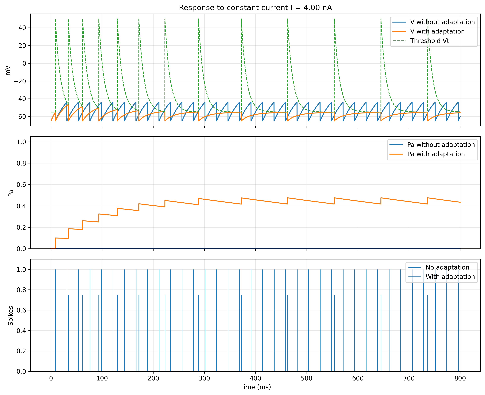

# Adaptive Neuron Report

## Overview
This module extends the basic integrate-and-fire neuron by adding an adaptation conductance. The goal is to study how adaptation changes the response of the neuron under constant input current and how it modifies firing-rate behavior.

The report compares neuron response in two conditions:

- without adaptation,
- with adaptation.

It also includes the current-discharge-rate curve as a function of constant current.

---

## Objective
The purpose of this simulation is to evaluate the effect of a slow adaptation conductance on firing behavior.

More specifically, the analysis studies:

- membrane-potential response to constant current,
- effect of adaptation on spike timing,
- evolution of the refractory threshold,
- evolution of the adaptation state variable,
- change in firing rate as input current increases.

---

## Background
In the standard integrate-and-fire model, the membrane behaves below threshold like a leaky RC system. When membrane potential reaches threshold, the neuron emits a spike and resets. This simplified framework captures core firing behavior without full ionic-channel dynamics.

A limitation of the simplest form is that under sustained current it may fire too regularly and too strongly. Real neurons often show adaptation: as firing continues, excitability decreases. A practical way to model this is adding an adaptation conductance with a hyperpolarized reversal potential. This conductance grows after each spike and decays slowly over time, reducing sustained firing rate.

---

## Model Description
The neuron includes two recovery mechanisms:

- dynamic threshold `Vt` (refractory effect),
- adaptation conductance `ga`, driven by state variable `Pa`.

Operationally:

- after a spike, threshold is increased,
- after a spike, adaptation state is increased,
- between spikes, both variables relax exponentially,
- as adaptation accumulates, neuron excitability is reduced.

Adaptation conductance:

`ga = gamax * Pa`

At every time step, effective membrane terms are recomputed:

- total conductance `geq`,
- equivalent reversal potential `Eeq`,
- equivalent resistance `req`,
- effective time constant `tau_eff`,
- asymptotic potential `Vinf`.

Subthreshold voltage update:

`V[k+1] = Vinf + (V[k] - Vinf) * exp(-dt/tau_eff)`

Threshold and adaptation updates:

`Vt[k+1] = Vtl + (Vt[k] - Vtl) * exp(-dt/taut)`

`Pa[k+1] = Pa[k] * exp(-dt/taua)`

Spike/reset rule:

- if `V[k+1] >= Vt[k+1]`, then reset `V[k+1] = E0`,
- set `Vt[k+1] = Vth`,
- with adaptation enabled: `Pa[k+1] = Pa[k+1] + dPa*(1 - Pa[k+1])`.

---

## Parameters Used
The model uses biologically reasonable adaptation settings:

- adaptation time constant in the 300-1000 ms range,
- adaptation reversal potential near `-90 mV`,
- moderate adaptation strength (`r * ga,max` order 1-5),
- small spike increment for adaptation state.

Values used in code:

- `E0 = -65 mV`
- `r = 10 MOhm`
- `taum = 30 ms`
- `Vtl = -55 mV`
- `Vth = 50 mV`
- `taut = 10 ms`
- `Ea = -90 mV`
- `taua = 700 ms`
- `dPa = 0.10`
- `rgamax = 2.0` (so `gamax = rgamax/r`)
- `dt = 0.05 ms`
- `tend = 800 ms`

---

## Numerical Method
The simulation is discrete-time with exact exponential updates for first-order dynamics.

At each time step:

- `Vt` decays toward `Vtl`,
- `Pa` decays toward zero,
- `ga` is computed from `Pa`,
- membrane voltage is updated with the exponential closed form,
- if threshold crossing occurs, spike/reset and state jumps are applied.

This gives stable behavior while preserving refractory and adaptation effects clearly.

---

## Results

## 1. Dynamics Under Constant Current
The first figure shows the temporal evolution of:

- membrane potential `V`,
- dynamic threshold `Vt`,
- adaptation variable `Pa`,
- spike timing.

This view shows how adaptation builds up during repeated firing and reduces excitability over time.



## 2. Current-Discharge-Rate Curve
The second figure shows firing rate versus input current.

This summarizes the functional effect of adaptation: for the same input current, the adapting model reaches a lower steady-state firing rate than the non-adapting model.


---

## Interpretation
Adaptation acts as a self-regulating mechanism:

- each spike increases `Pa`,
- higher `Pa` increases `ga`,
- higher `ga` shifts dynamics toward hyperpolarized `Ea`,
- effective excitability decreases,
- sustained firing rate is reduced.

In simple terms, the neuron initially responds strongly, then slows down under continuous stimulation.

---

## Comparison: Without vs With Adaptation
Without adaptation:

- firing depends mainly on input current and refractory threshold,
- spike trains are more regular at fixed current,
- steady-state rate is higher.

With adaptation:

- each spike increases adaptation conductance,
- neuron becomes progressively less excitable,
- sustained firing rate is reduced,
- the f-I curve shifts downward.

---

## Limitations
Current implementation is strong qualitatively, but can be extended by:

- estimating rate over a longer steady-state window (not only last ISI-based estimate),
- testing time-varying or noisy inputs,
- adding quantitative summary across parameter sweeps.

---

## Conclusion
Adding adaptation conductance significantly changes integrate-and-fire behavior.

Compared with the non-adaptive case, the adaptive neuron:

- becomes less excitable during sustained stimulation,
- shows lower steady-state firing rate,
- displays realistic spike-frequency adaptation,
- produces a downward-shifted current-discharge-rate curve.

This provides a compact but biologically meaningful extension of the standard integrate-and-fire model.

---

## Figure Captions
- **Figure 1 - Adaptive neuron dynamics under constant current.**  
Membrane potential, dynamic threshold, adaptation state, and spike timing.
- **Figure 2 - Current-discharge-rate curve.**  
Steady firing rate versus constant input current, comparing non-adaptive and adaptive behavior.

---

## Reproducibility
Run:

```powershell
python 02_adaptive_neuron/adaptive_neuron.py
```

Figures are saved in:

- `02_adaptive_neuron/figures/adaptive_neuron_fig_001_comparison.png`
- `02_adaptive_neuron/figures/adaptive_neuron_fig_002_fi_curve.png`
