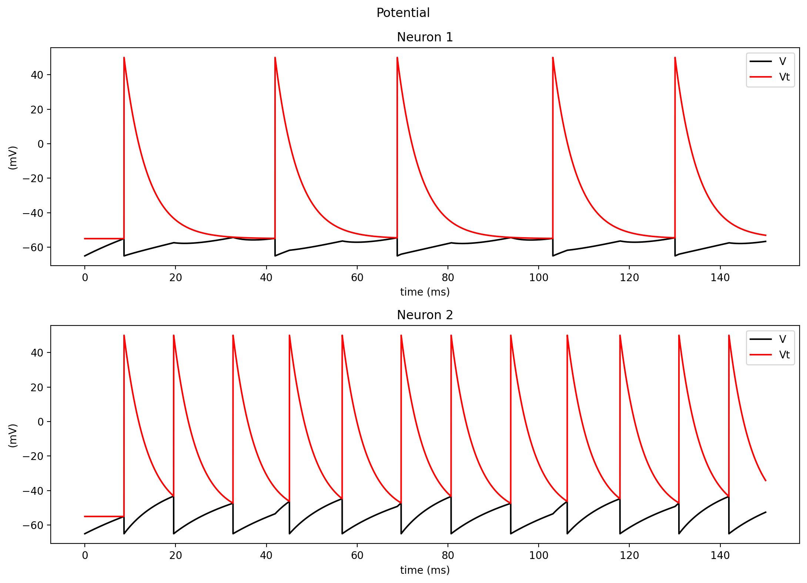
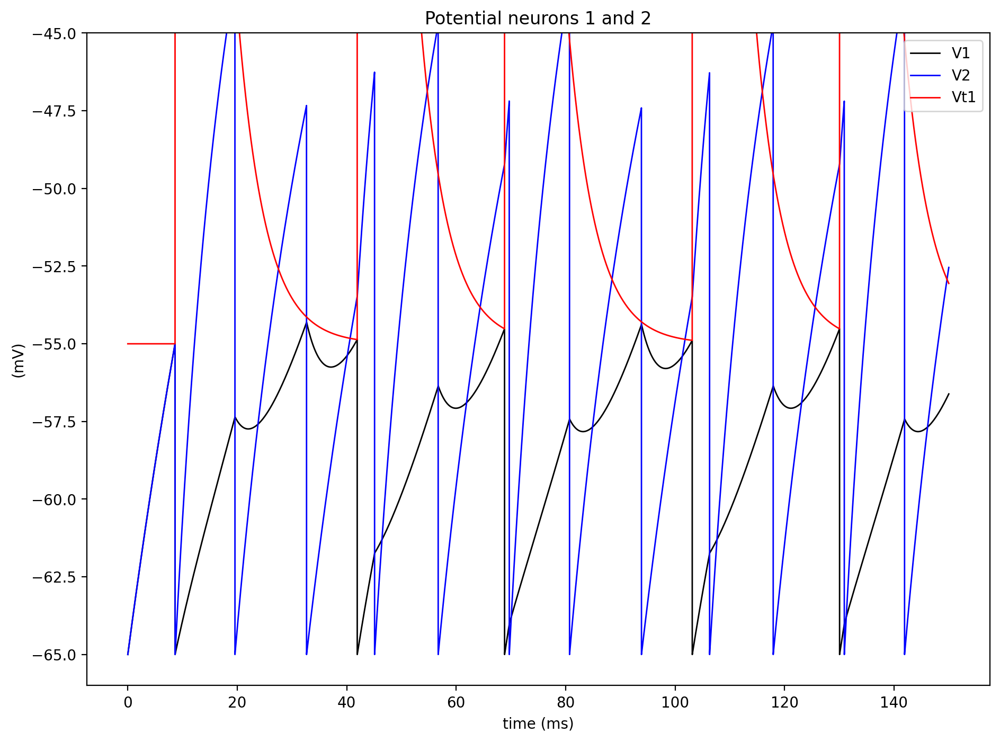
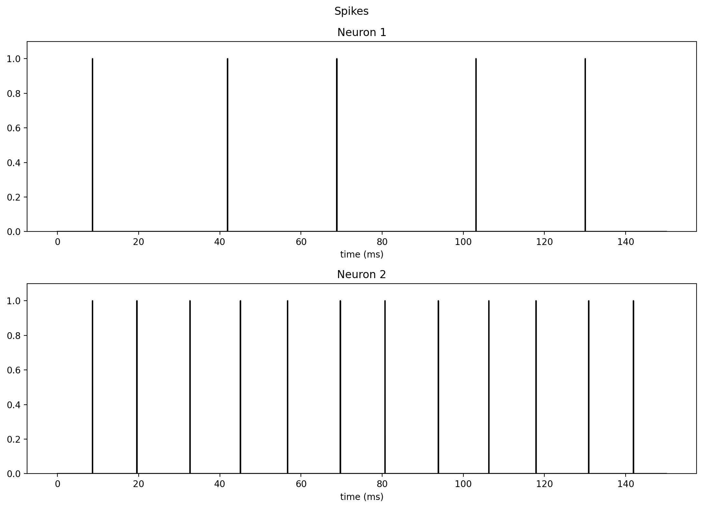
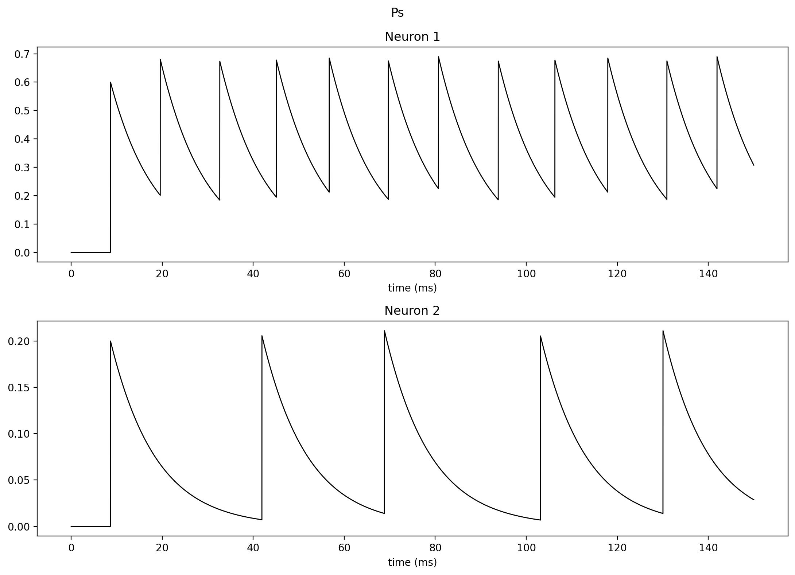

# Coupled Neurons Report

## Objective
Simulate two coupled integrate-and-fire neurons through synaptic conductances (excitatory/inhibitory coupling) and evaluate synchrony.

## Model Used in Code
For each neuron:
- `geq = g + gs`
- `E0tot = (g*E0 + gs*Es) / geq`
- `rtot = 1 / geq`
- `Vinf = E0tot + rtot*I`
- `tau = C * rtot`
- `V[k+1] = (V[k] - Vinf) * exp(-dt/tau) + Vinf`
- `Vt[k+1] = (Vt[k] - Vtl) * exp(-dt/taut) + Vtl`
- `Ps[k+1] = Ps[k] * exp(-dt/taus)`
- If spike: reset `V`, raise `Vt`, update opposite synaptic state `Ps`.

## Results
Potentials of both neurons:

Overlay of membrane potentials:

Spike trains:

Synaptic state variables:

