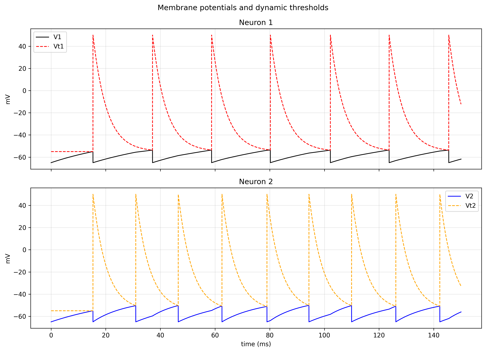
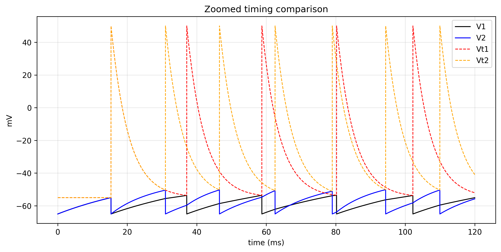
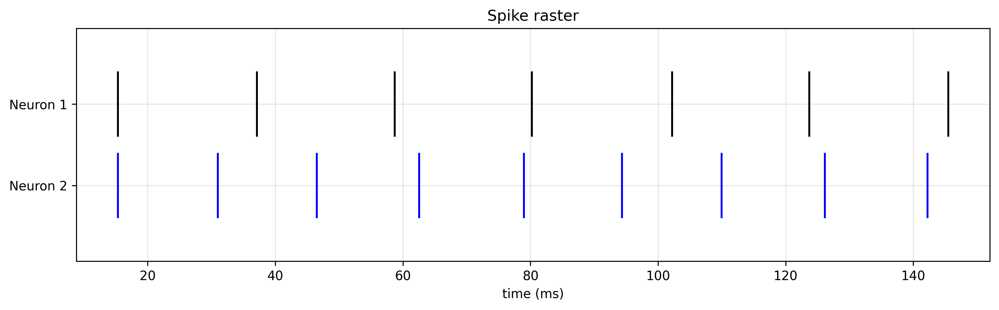
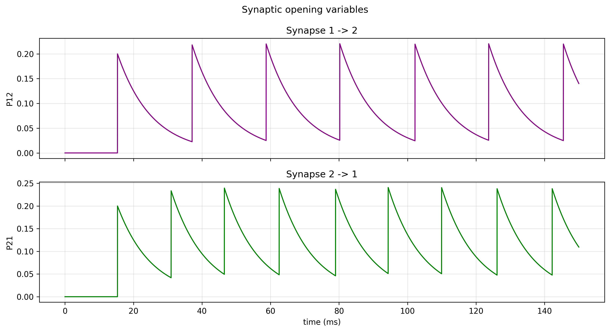
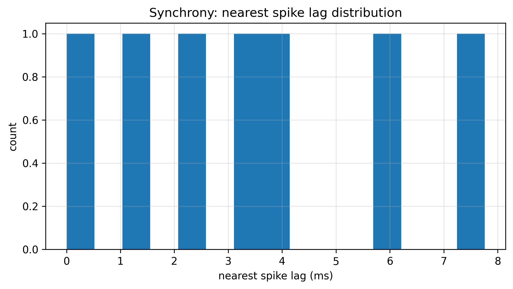

# Coupled Neurons Report

## Overview
This module analyzes two coupled integrate-and-fire neurons with conductance-based synapses, dynamic thresholds, and constant external current.

The goal is to study how excitatory/inhibitory coupling affects:

- spike timing,
- firing rate,
- synchrony between the two neurons.

## Objective
The simulation evaluates:

- membrane dynamics of both neurons,
- threshold recovery after spikes,
- synaptic interaction through conductance variables,
- spike-train synchrony.

## Model Summary
For each neuron, the membrane update is based on equivalent conductance:

- `geq = g + gsyn`
- `Eeq = (g*E0 + gsyn*Esyn)/geq`
- `req = 1/geq`
- `tau = C*req`
- `Vinf = Eeq + req*I`

Voltage update:

`V[k+1] = (V[k] - Vinf) * exp(-dt/tau) + Vinf`

Threshold recovery:

`Vt[k+1] = (Vt[k] - Vt_low) * exp(-dt/taut) + Vt_low`

Synaptic opening variable:

`P[k+1] = P[k] * exp(-dt/taus)`

On spike:

- membrane resets to `E0`,
- threshold jumps to `Vt_high`,
- outgoing synaptic opening variable increases by `dP * (1 - P)`.

## Parameters Used
- `E0 = -65 mV`
- `r = 10 MOhm`
- `taum = 30 ms`
- `taut = 5 ms`
- `Vt_low = -55 mV`
- `Vt_high = 50 mV`
- `dt = 0.01 ms`
- `tmax = 150 ms`
- `I1 = I2 = 2.5 nA`
- `tau_12 = tau_21 = 10 ms`
- `dP_12 = dP_21 = 0.20`
- `E_12 = 0 mV` (excitatory)
- `E_21 = -70 mV` (inhibitory)
- `r * gsmax = 2` in both directions

## Results

### Figure 1 - Membrane Potentials and Dynamic Thresholds


### Figure 2 - Zoomed Timing Comparison


### Figure 3 - Spike Raster


### Figure 4 - Synaptic Opening Variables


### Figure 5 - Nearest Spike-Lag Histogram


## Interpretation
- The dynamic threshold enforces relative refractoriness and prevents immediate re-firing.
- Mixed synapse types (excitatory one direction, inhibitory the other) produce asymmetric timing behavior.
- The spike raster and lag histogram provide a direct synchrony view.
- Synaptic opening traces explain how interaction strength evolves over time.

## Conclusion
The coupled-neuron model captures key timing effects of recurrent interaction with minimal complexity. Conductance coupling plus threshold recovery is sufficient to generate nontrivial synchrony, lag structure, and direction-dependent influence between neurons.

## Reproducibility
Run:

```powershell
python 03_coupled_neurons/coupled_neurons.py
```

Generated outputs are saved in:

- `03_coupled_neurons/figures/`
