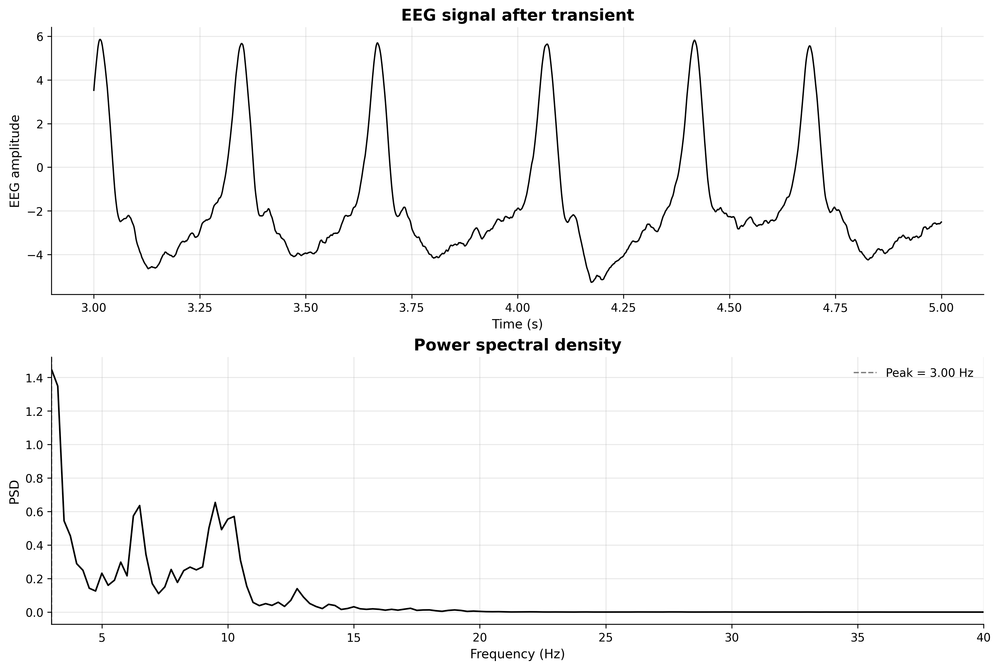

# Neural Mass Model Report

## Overview
This module implements the **Jansen-Rit neural mass model**, a classical population-level model of cortical activity.

The simulation describes the interaction among three neuronal populations inside a cortical column:

- **pyramidal neurons**
- **excitatory interneurons**
- **inhibitory interneurons**

The objective is to generate an **EEG-like signal** and analyze it in both the **time domain** and the **frequency domain**.

---

## Background
Unlike single-neuron spiking models, neural mass models represent the **average activity of neuronal populations** rather than the exact timing of individual spikes. This makes them useful for reproducing collective oscillatory activity observed in EEG.

In the Jansen-Rit framework:

- pyramidal neurons receive both **excitatory** and **inhibitory** feedback,
- excitatory interneurons project back to pyramidal neurons,
- inhibitory interneurons reduce pyramidal activity,
- external input is modeled as **Gaussian white noise**, injected through excitatory dynamics.

With standard parameters, the model is often used to study alpha-like rhythms.

---

## Model Structure
The model contains three interacting second-order synaptic subsystems:

- pyramidal population: `yp, zp`
- excitatory interneurons: `ye, ze`
- inhibitory interneurons: `yi, zi`

Population firing rate is given by:

```text
S(v) = rmax / (1 + exp(-k * (v - v0)))
```

with:

- `v0 = 6 mV`
- `kr = 0.56 mV^-1`
- `rmax = 5 s^-1`

Synaptic couplings:

- `Wep = 135`
- `Wpe = 0.8 * Wep`
- `Wip = 0.25 * Wep`
- `Wpi = 0.25 * Wep`

Gains and inverse time constants:

- `Ae = 3.25 mV`
- `Ai = 22 mV`
- `ae = 100 s^-1`
- `ai = 50 s^-1`

---

## Governing Equations
### Pyramidal population
```text
dyp/dt = zp
dzp/dt = Ae * ae * rp - 2 * ae * zp - ae^2 * yp
vp = Wpe * ye - Wpi * yi
rp = S(vp)
```

### Excitatory interneurons
```text
dye/dt = ze
dze/dt = Ae * ae * (re + n / Wep) - 2 * ae * ze - ae^2 * ye
ve = Wep * yp
re = S(ve)
```

### Inhibitory interneurons
```text
dyi/dt = zi
dzi/dt = Ai * ai * ri - 2 * ai * zi - ai^2 * yi
vi = Wip * yp
ri = S(vi)
```

EEG-like output:

```text
eeg = Wpe * ye - Wpi * yi
```

This represents the net excitatory-inhibitory contribution reaching pyramidal dynamics.

---

## Numerical Implementation
The model is implemented with:

- `NumPy` for numerical simulation,
- `Matplotlib` for plotting,
- `SciPy` (`welch`) for PSD estimation.

Simulation settings:

- integration method: **Euler**
- time step: `dt = 1e-4 s`
- total time: `20 s`
- external input: Gaussian white noise
  - mean = `160`
  - standard deviation = `200`

A fixed random seed is used for reproducibility.

---

## Signal Processing Pipeline
After simulation:

1. EEG-like signal is computed,
2. initial transient is removed (`2 s`),
3. steady-state signal is mean-centered,
4. PSD is estimated with **Welch's method**.

PSD settings:

- sampling frequency: `fs = 1 / dt`
- segment length: `4 s`
- overlap: `2 s`

Frequencies below `3 Hz` are excluded for peak detection and plotting focus.

---

## Results
The updated code exports one figure with two panels:

- EEG signal after transient (time domain),
- power spectral density with dominant peak marker.



Latest run summary:

- `Wep = 135.0`
- Peak frequency = `3.00 Hz`
- Peak power = `1.4490e+00`

---

## Interpretation
This simulation shows that rhythmic activity can emerge from excitatory-inhibitory population interactions under noisy drive.

Key points:

- oscillatory structure appears clearly in the time-domain signal,
- PSD gives a compact summary of dominant rhythmic content,
- resulting dominant frequency depends on parameter regime, preprocessing choices, and spectral settings.

If a specific target band is desired, influential parameters include `Wep`, `ae`, and `ai`, as well as transient length and PSD configuration.

---

## Suggested Extensions
- Sweep `Wep` and track dominant frequency transitions.
- Sweep `ae`/`ai` to study time-constant effects on rhythm.
- Compare parameter regimes for alpha-like vs beta-like activity.
- Automate batch runs with peak extraction and summary tables.
- Save all figures/metrics for each run into structured experiment folders.

---

## Conclusion
The Jansen-Rit neural mass model provides a compact and physiologically meaningful description of cortical population dynamics.

Using three interacting populations and noisy external input, it generates EEG-like output whose oscillatory content can be quantified with PSD analysis. This offers a practical framework for studying large-scale neural rhythms without simulating individual spikes.

---

## Reproducibility
Run:

```bash
python 04_neural_mass_model/neural_mass_model.py
```
