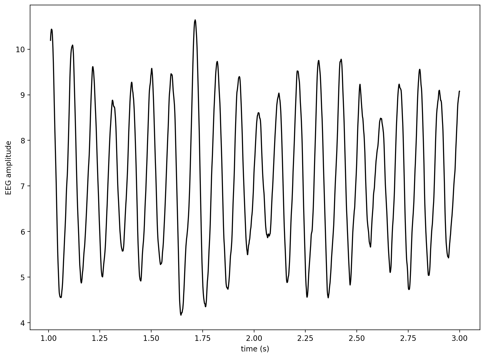
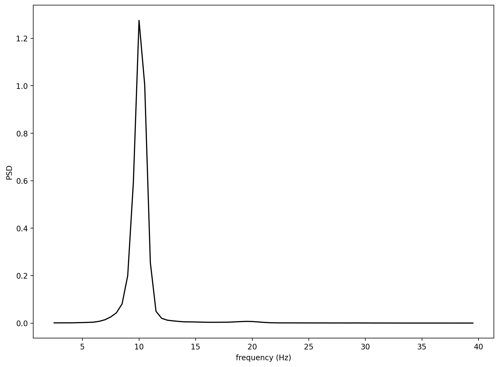

# Report: Exercise 05

## Scope
This exercise simulates the Jansen-De Rit neural mass model and evaluates both time-domain and spectral behavior of the generated EEG-like signal.

## Implementation Summary
Three interacting populations are modeled:
- pyramidal neurons,
- excitatory interneurons,
- inhibitory interneurons.

The code integrates six coupled first-order state equations with Euler method.  
Population firing rates are computed with a sigmoidal transfer function, and noisy afferent drive is injected into the excitatory loop.

EEG proxy used in the script:
- eeg = Wpe * ye - Wpi * yi

Spectral analysis:
- Welch power spectral density estimate.

## Results and Discussion
- The simulated trace shows oscillatory activity after initial transients.
- The PSD highlights dominant rhythmic components expected from the chosen parameter regime.

## Conclusion
The neural mass configuration reproduces structured oscillatory dynamics and demonstrates how mesoscopic population models can generate realistic EEG-like rhythms.
