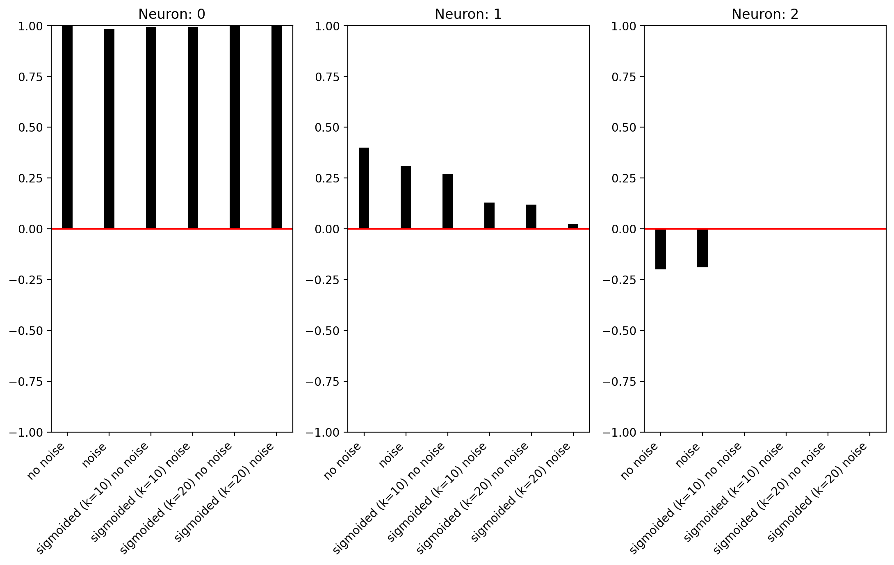
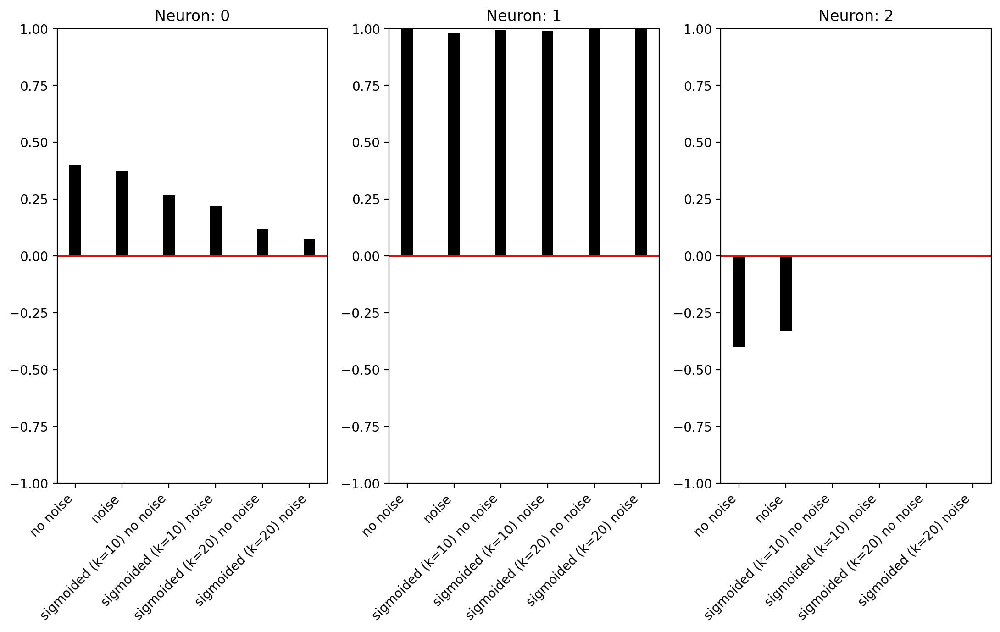
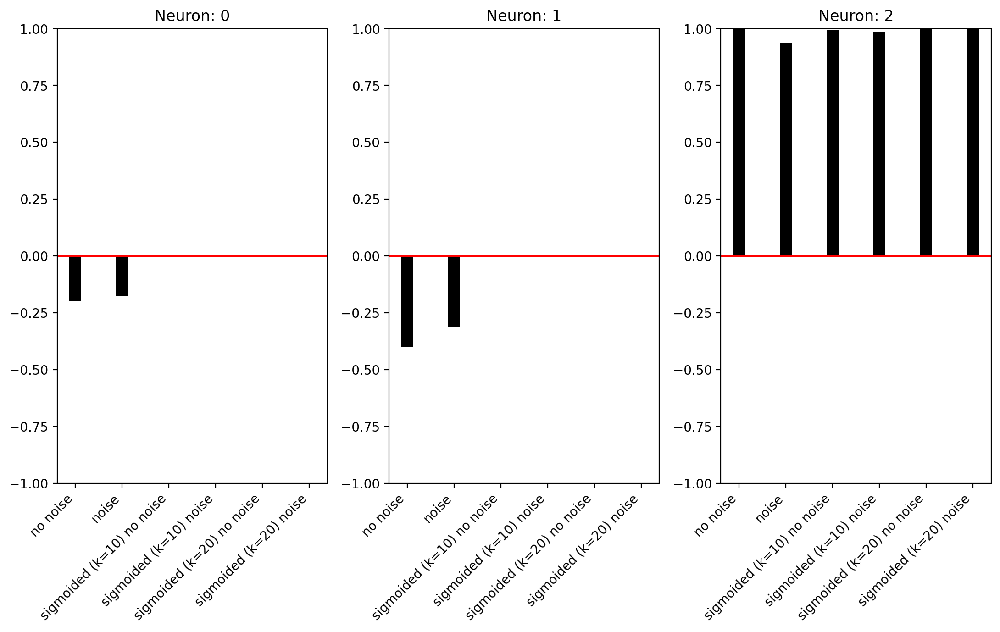
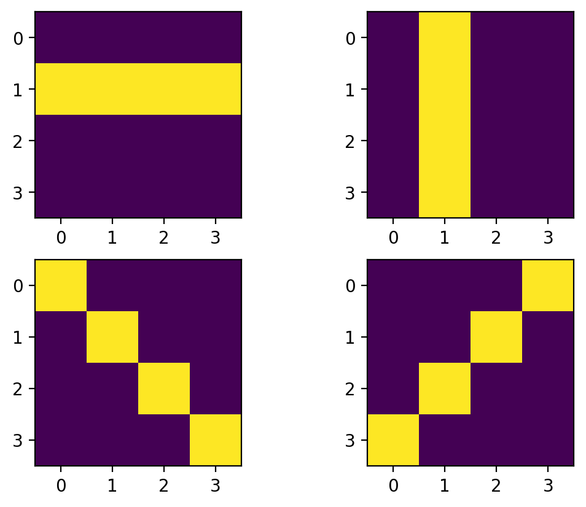
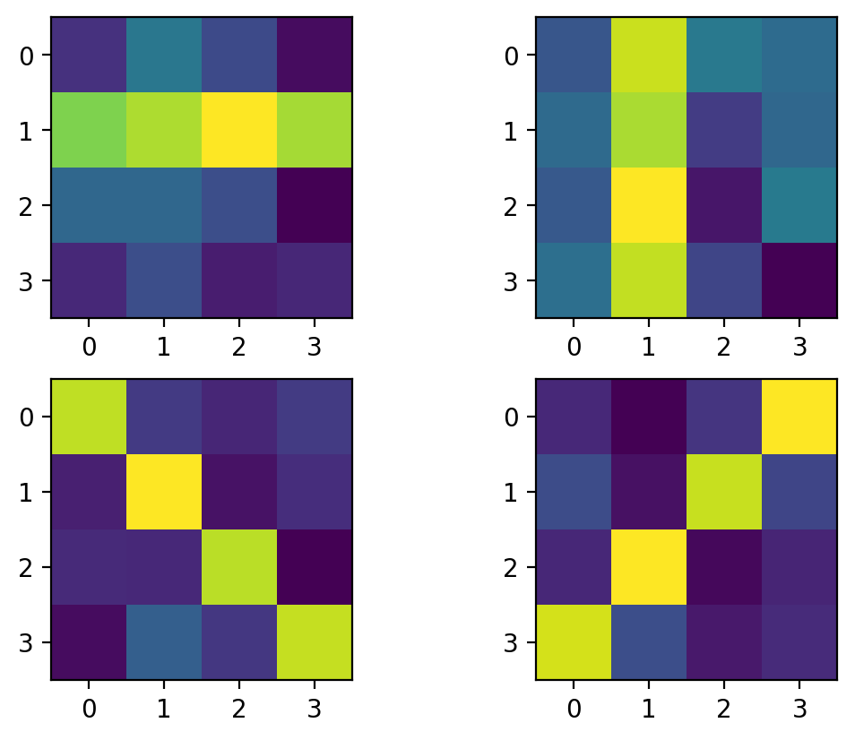
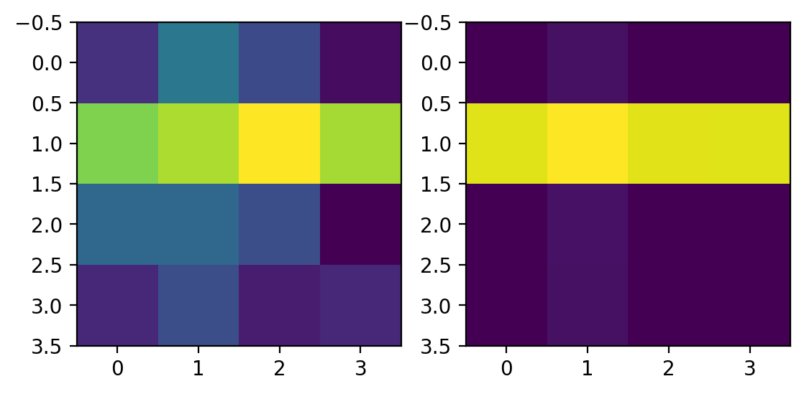
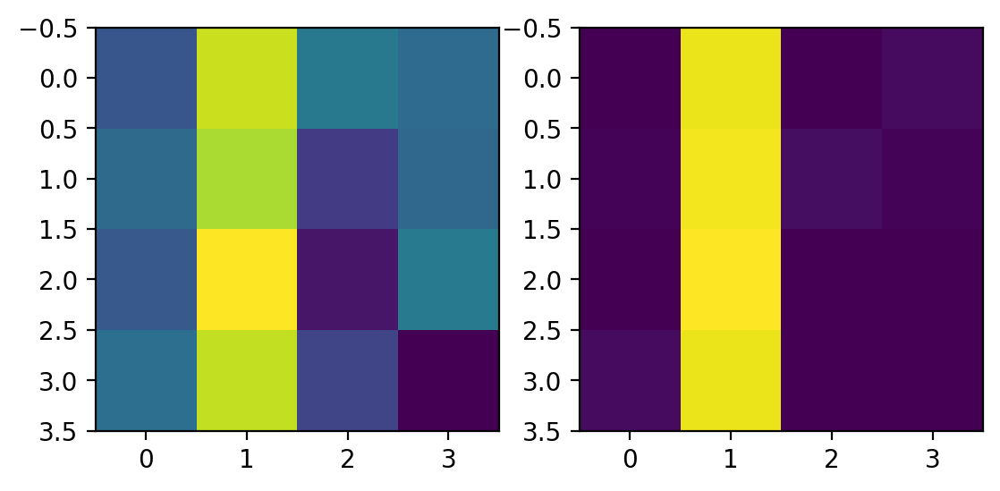
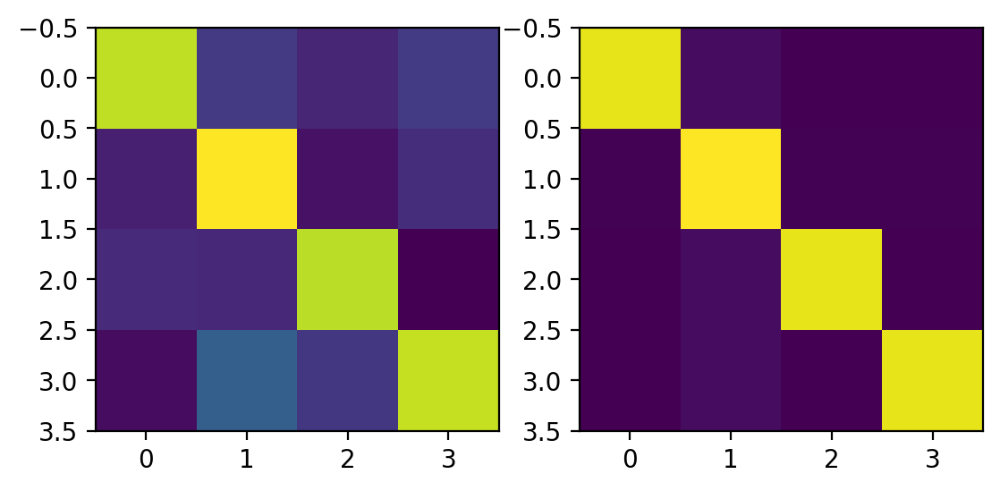

# Exercises 06-07 Report

## Exercise 06 (Hetero-Associative Network, 10x3)

### Model Used in Code
- Training (Hebbian linear map): `W = Y * X^T`
- Linear output: `Yout = W * X`
- Sigmoid output test: `1 / (1 + exp(-k*(Yout - 0.5)))` with different `k`.

### Results
Bar-plot comparisons for three input patterns:

## Exercise 07 (Hetero-Associative Network, 16x4 with 4x4 bars)

### Model Used in Code
- Four 4x4 bar-like patterns converted to 16-element vectors.
- Training: `W = Y * X^T` with 4 outputs.
- Noisy inputs + sigmoid readout (`k=20`).
- Reconstructed image from weighted clean templates.

### Results
Pattern visualization, noisy inputs, and reconstructions:

