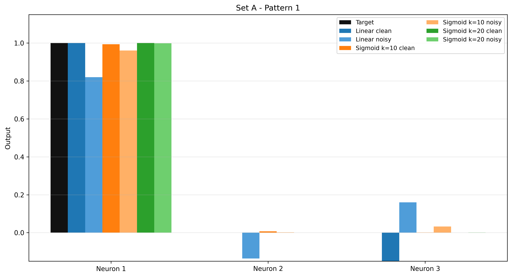
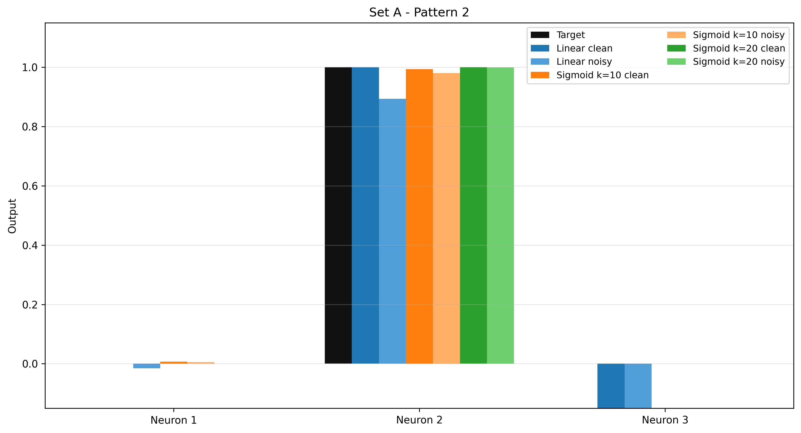
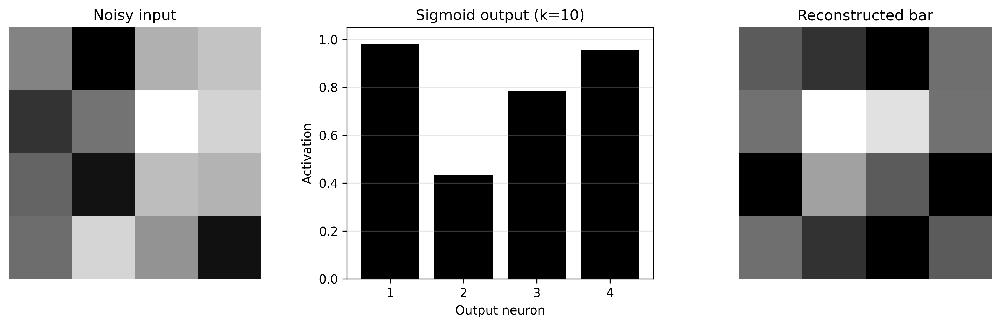
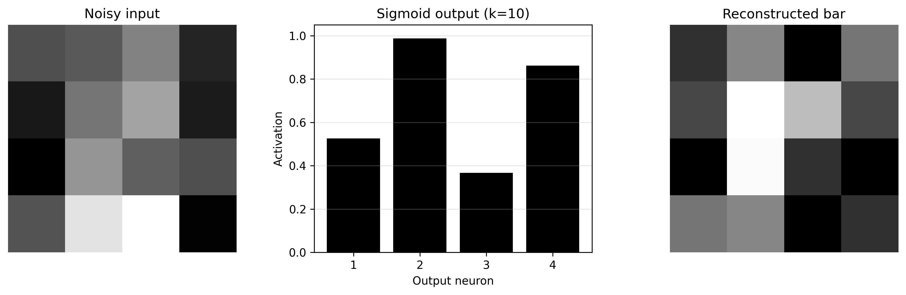
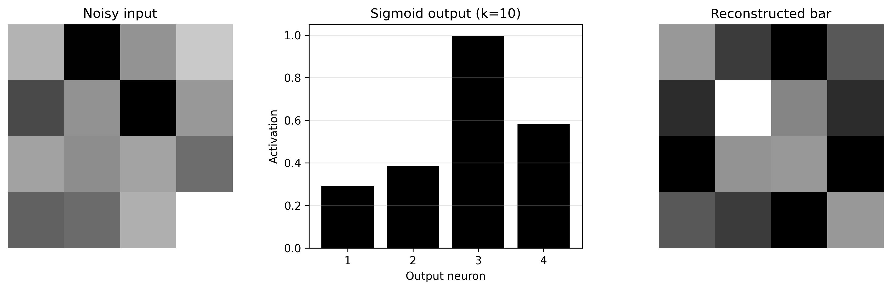
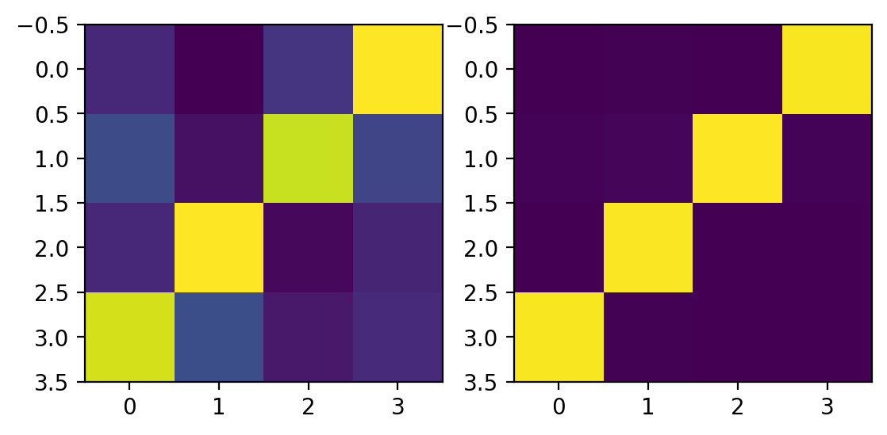
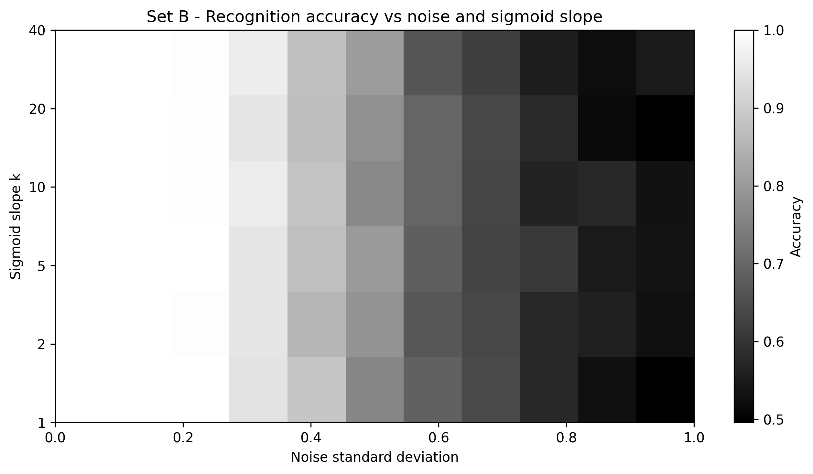

# Associative Networks Report

## Overview
This module contains two implementations of hetero-associative networks trained with Hebb's rule:

- **Pattern Set A**: three normalized binary patterns of length 10 mapped to three output neurons.
- **Pattern Set B**: four bar-like patterns on a **4x4 grid** mapped to four output neurons.

In both cases, the objective is to study how a feedforward associative memory learns input-output mappings and how performance changes under noise and nonlinear output activation.

---

## Theoretical Background
A linear hetero-associative network maps input vector `X` to output vector `Y` through:

```text
Y = W X
```

With Hebbian training over multiple pairs `(X^p, Y^p)`, the weight matrix is:

```text
W = sum_p Y^p (X^p)^T
```

For reliable recall, input patterns should be normalized and as orthogonal as possible. Correlated patterns increase cross-talk and degrade recognition quality.

Nonlinear readout is introduced through a sigmoid:

```text
S(u) = 1 / (1 + exp(-k (u - u0)))
```

where:

- `k` controls slope,
- `u0` is the center value.

For Set A in this repository, sigmoid output is centered at `u0 = 0.5` and bounded in `[0,1]`.

---

## Pattern Set A - 10 Inputs, 3 Outputs

### Objective
Three binary vectors (`±1`, length 10) are generated, normalized, and arranged as columns of `X`. The desired output is one-hot over three neurons:

- pattern 1 -> neuron 1 active,
- pattern 2 -> neuron 2 active,
- pattern 3 -> neuron 3 active.

### Model
Training uses:

```text
W = Y X^T
```

Evaluation includes:

- clean inputs with linear output,
- noisy inputs (Gaussian perturbation + renormalization),
- sigmoid readout with different slopes.

### Interpretation
Set A demonstrates:

1. linear recall sensitivity to pattern correlation,
2. noise-induced degradation in linear responses,
3. improved class separation with steeper sigmoid slopes.

### Results (Set A)




---

## Pattern Set B - 16 Inputs, 4 Outputs (4x4 Bars)

### Objective
The second model stores four binary 4x4 bar patterns (horizontal, vertical, main diagonal, anti-diagonal) as 16-element vectors.

### Model
The same Hebbian map is used:

```text
W = Y X^T
```

Pipeline:

- add Gaussian noise to normalized input vectors,
- evaluate linear and sigmoid outputs,
- reconstruct bars from output activations,
- analyze recognition accuracy versus noise level and sigmoid slope.

### Interpretation
Set B makes recognition behavior visually explicit:

- linear outputs tend to remain mixed,
- sigmoid output can sharpen winner selection,
- increasing noise reduces recognition reliability,
- slope `k` controls robustness/discrimination tradeoff.

### Results (Set B)








---

## Main Takeaways
- Hebbian hetero-associative learning is simple and interpretable.
- Pattern similarity directly affects recall quality through cross-talk.
- Sigmoid nonlinearity improves recognition when target outputs are near 0/1.
- Noise-sweep analysis is essential to evaluate practical robustness.

---

## Limitations
- Pattern sets are small and partially correlated.
- Network is purely feedforward (no recurrent refinement).
- Reconstruction is template-based, not decoder-learned.
- Performance depends strongly on normalization, noise level, and slope selection.

---

## Conclusion
Together, Set A and Set B provide a clear progression from vector-based associative mapping to image-like pattern recognition.

The experiments show how Hebbian learning, pattern correlation, noise, and sigmoid slope jointly determine associative-network performance.
