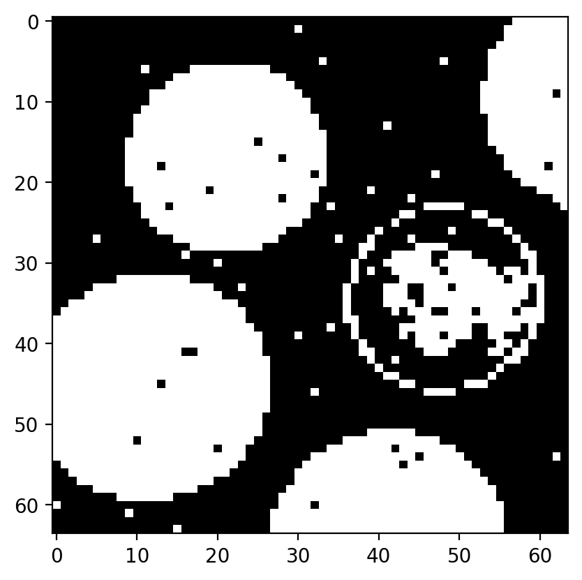

# Hopfield Reconstruction Report

## Objective
Hopfield network for image memory and recovery from corrupted patterns.

## Model Used in Code
- Images converted to binary then to {-1, +1}.
- Downsampled to 64x64.
- Pattern vectors: `Y1, Y2, Y3`.
- Hebbian memory:
  - `W = Y1*Y1^T + Y2*Y2^T + Y3*Y3^T`
- Asynchronous update:
  - Find unstable neurons: `idx where Y*(W*Y) < 0`
  - Randomly pick one unstable neuron and flip sign.
  - Repeat until no unstable neurons remain.

## Results
The script exports a chronological sequence (`exercise08_fig_001` to `exercise08_fig_010`) covering storage, corruption, and iterative recovery.

### Figure Timeline
- **Fig 1**: stored patterns after preprocessing and downsampling.
- **Fig 2**: corrupted initial state used as network input.
- **Fig 3-10**: asynchronous recovery trajectory snapshots.

### Visual Gallery
**Figure 1 - Stored Patterns (Memory Set)**

  

**Figure 2 - Corrupted Initial Pattern**

  

**Figure 3 - Recovery Snapshot 1**

  

**Figure 4 - Recovery Snapshot 2**

  

**Figure 5 - Recovery Snapshot 3**

  

**Figure 6 - Recovery Snapshot 4**

  

**Figure 7 - Recovery Snapshot 5**

  

**Figure 8 - Recovery Snapshot 6**

  

**Figure 9 - Recovery Snapshot 7**

  

**Figure 10 - Recovered Stable Pattern**

  

Display width is normalized for readability; original figure resolution is unchanged.

### Notes For Selected Figures
1. **Fig 1** shows the three binary memories embedded in the Hopfield weight matrix.
2. **Fig 2** is a noisy/perturbed version of one stored pattern before dynamics start.
3. **Fig 3-10** illustrate gradual denoising as unstable neurons are updated asynchronously.
4. **Fig 10** corresponds to a stable attractor reached when no unstable neurons remain.

## Reconstruction Dynamics Interpretation
### What The Patterns Represent
- Pixel values are mapped to neuron states in `{-1, +1}`.
- The network stores three image memories (`saturn`, `vertigo`, `coins`) after thresholding and downsampling to 64x64.
- Recovery starts from a corrupted version of one stored memory (`perc = 0.02` random sign flips).

### Why Recovery Works
- Weights are built with Hebbian superposition: `W = Y1Y1^T + Y2Y2^T + Y3Y3^T`.
- An unstable neuron satisfies `Y_i * (WY)_i < 0`, meaning its current state disagrees with its local field.
- One unstable neuron is flipped at each step, and the unstable set is recomputed.
- The process terminates at `L = 0`, where `L` is the number of unstable neurons.

### How To Read The Sequence
- Early snapshots retain visible corruption and mixed edges.
- Mid snapshots show progressive alignment with one stored attractor.
- The final snapshot shows convergence to a stable recalled pattern.
- Minor artifacts can remain depending on noise level and memory interference.
