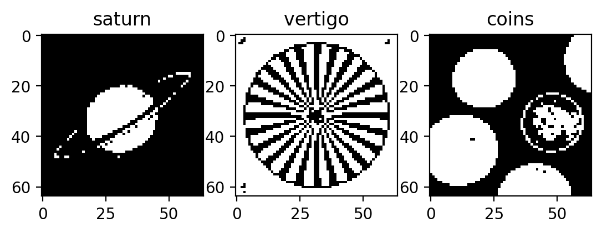
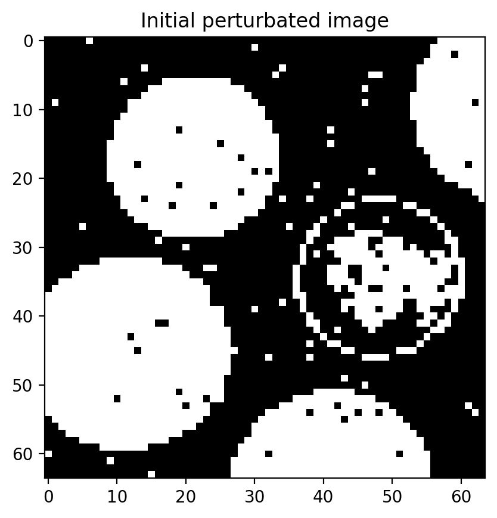
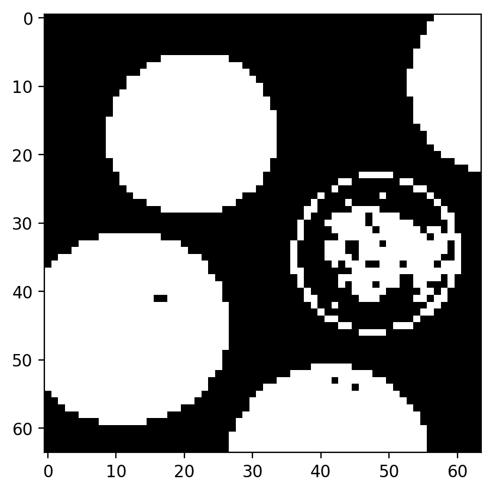
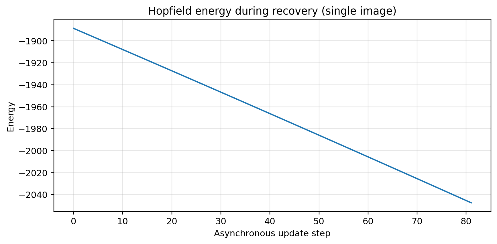
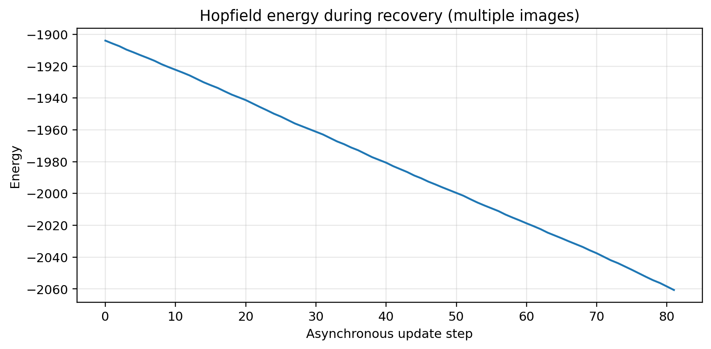

# Hopfield Reconstruction from Corrupted Images

## Objective
The goal is to implement a **binary Hopfield network** for image storage and reconstruction.  
Starting from grayscale images contained in `imdemos.mat`, the images are converted into binary patterns, mapped to the set `{-1,+1}`, reduced to `64 x 64`, and stored in the synaptic matrix through the **Hebb rule**. The network is then tested in two conditions:

1. **single-image storage**, to verify basic recovery from a corrupted pattern;
2. **multi-image storage**, to evaluate recall in the presence of interference between multiple memories.

---

## Project Requirements
According to the project specification, the implementation must:

- load `128 x 128` grayscale images from `imdemos.mat`,
- threshold them at `128` to obtain binary images,
- convert binary values to `-1` and `+1`,
- reduce the images to `64 x 64` by selecting even rows and columns,
- convert each pattern from matrix form to a vector of length `L^2`,
- train a binary Hopfield network with the **Hebbian rule**,
- start from a corrupted pattern,
- use an **asynchronous update rule** in which the list of unstable neurons is computed and then one neuron is randomly selected and updated,
- test both the **single-pattern** and the **multiple-pattern** case.

---

## Preprocessing Pipeline
Three images are extracted from `imdemos.mat`:

- `saturn`
- `vertigo`
- `coins`

The code applies the following preprocessing steps:

1. **Thresholding**
   `I_bw(x,y) = 1 if I(x,y) >= 128, else 0`

2. **Conversion to Hopfield states**
   `I_pm1 = 2 * I_bw - 1`
   so that background pixels become `-1` and foreground pixels become `+1`.

3. **Spatial reduction**
   the original `128 x 128` image is reduced to `64 x 64` by selecting rows and columns with even spacing:
   `I_64 = I_pm1[::2, ::2]`

4. **Vectorization**
   each `64 x 64` pattern is reshaped into a vector of length:
   `N = 64^2 = 4096`

---

## Hopfield Model
The Hopfield network is an **auto-associative memory** made of `N` fully interconnected binary neurons with outputs in `{-1,+1}`. The model stores patterns as equilibrium points of the dynamics, so that a corrupted version of a stored pattern can converge back to the original memory if it starts inside its basin of attraction.

### Hebbian learning
Given a set of stored patterns `Y^(p)`, the synaptic matrix is built as

`W = sum_{p=1..M} (Y^(p) * (Y^(p))^T)`

In the code, the matrix is also normalized by `N`, and the diagonal is set to zero:

`w_ii = 0`

so that self-connections are removed.

### Asynchronous update
The model uses **asynchronous dynamics**, where only one neuron is allowed to switch at each step.

For a current state vector `y`, the local field is

`h = W * y`

and the set of unstable neurons is computed through the condition

`y_i * h_i < 0`

which means that the current neuron state is inconsistent with its local field. One unstable neuron is then randomly selected and updated.

### Energy function
To monitor convergence, the code evaluates the Hopfield energy

`E = -0.5 * y^T * W * y`

For symmetric weights and asynchronous updating, the energy can only decrease until the network reaches a stable equilibrium point.

---

## Pattern Correlation Analysis
Before storing multiple images, the code computes the scalar products between the vectorized patterns:

- `saturn` vs `vertigo`
- `saturn` vs `coins`
- `vertigo` vs `coins`

This step is important because highly correlated patterns reduce memory quality, while weakly correlated patterns are easier to store correctly.

---

## Experiments
## 1. Single-image storage
In the first experiment, only one image (`coins`) is stored in the network.

### Procedure
- build the weight matrix using only the `coins` pattern;
- corrupt the stored vector by flipping exactly `2%` of the neurons;
- run asynchronous Hopfield dynamics until no unstable neurons remain.

### Figures
- original stored pattern
- corrupted initial pattern
- recovered final pattern
- energy during recovery

### Interpretation
This experiment verifies basic auto-associative behavior.  
With only one stored image, the attractor structure is simple and recovery is expected to work well as long as the corrupted image is not too far from the original pattern in Hamming distance.

---

## 2. Multi-image storage
In the second experiment, three patterns are stored simultaneously:

- `saturn`
- `vertigo`
- `coins`

The corrupted `coins` image is again used as the initial condition.

### Procedure
- build the weight matrix as the Hebbian sum of the three stored patterns;
- corrupt the `coins` vector with the same number of flipped neurons;
- run asynchronous recovery;
- compare the final state with the stored patterns through scalar products.

### Figures
- original target pattern
- corrupted target pattern
- recovered pattern
- energy during recovery

### Interpretation
When multiple images are stored, the network must recover the correct pattern despite interference from other memories. In theory, disturbance introduced by other patterns increases with the number of stored episodes, and recall quality depends strongly on the ratio `M/N` and pattern correlations.

The final overlaps printed by the code allow checking whether the recovered state remains closest to the intended memory (`coins`) or drifts toward another stored pattern.

---

## Recovery Dynamics
The asynchronous dynamics proceeds by repeatedly:

1. computing unstable neurons,
2. choosing one unstable neuron at random,
3. switching that neuron,
4. recomputing the unstable set.

The process stops when no unstable neuron remains.

From a dynamical point of view:

- in the early stage, the corrupted pattern still contains visible noise;
- during update, the state progressively aligns with the attractor;
- at convergence, the state becomes stable and no further neuron can switch.

The energy plots produced by the script should decrease monotonically or remain non-increasing, in agreement with Hopfield convergence theory for symmetric weights and asynchronous updates.

---

## Relation to Theory
This implementation reflects key theoretical properties of the Hopfield model:

### Auto-associative memory
The network is **content-addressable**: a partial or corrupted version of a memory can retrieve the whole pattern if the initial state lies within its basin of attraction.

### Distributed storage
Information is stored in the full synaptic matrix, not in a single neuron.

### Limited capacity
Memory capacity is limited, especially when stored patterns are random or correlated. Recall quality worsens as the number of stored memories increases.

### Spurious states
In addition to desired memories, the network may contain **spurious equilibrium points**, especially in the multiple-pattern case.

---

## Main Results to Highlight
This code demonstrates that:

- the preprocessing pipeline successfully converts grayscale images into Hopfield-compatible binary patterns;
- a single stored image can be recovered from a corrupted version;
- multiple stored images can still support recall, but recovery becomes more sensitive to interference;
- scalar products between patterns provide useful information about expected storage difficulty;
- the energy function provides quantitative confirmation of convergence.

---

## Limitations of the Current Implementation
Compared with a more extended study, this code does **not** include:

- an explicit experiment producing a **spurious attractor**;
- a systematic analysis of performance versus corruption level;
- a plot of overlap versus time;
- a quantitative reconstruction accuracy metric.

However, the current implementation already covers the core requirements and provides a clear comparison between single-pattern and multi-pattern storage.

---

## Conclusion
This project confirms the classical behavior of the Hopfield auto-associative network.  
After thresholding and reducing images, patterns are stored in the synaptic matrix through the Hebbian rule. Starting from a corrupted input, asynchronous dynamics progressively updates unstable neurons and leads the system toward a stable equilibrium point. In the single-image case, recall is typically robust; in the multi-image case, recall remains possible but becomes more sensitive to interference and pattern correlation.

Overall, the code provides a correct and clear implementation of binary Hopfield memory for image reconstruction, consistent with both project specifications and the theoretical properties of the model.

---

## Figure Gallery
**Figure 1**

  

**Figure 2**

  

**Figure 3**

  

**Figure 4**

  

**Figure 5**

  

**Figure 6**

  

**Figure 7**

  

**Figure 8**

  

**Figure 9**

  

**Figure 10**

  

**Figure 11 - Energy During Single-Image Recovery**

  

**Figure 12 - Energy During Multi-Image Recovery**

  

The monotonic decrease of the energy confirms the expected convergence of the asynchronous Hopfield dynamics toward a stable attractor.
