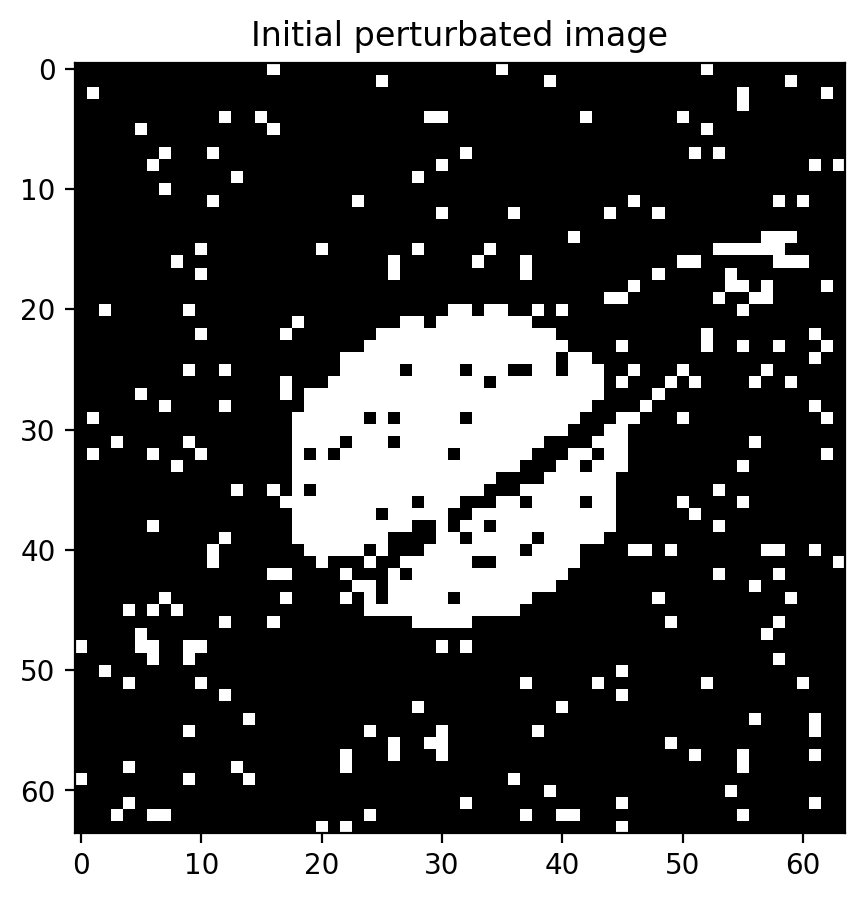
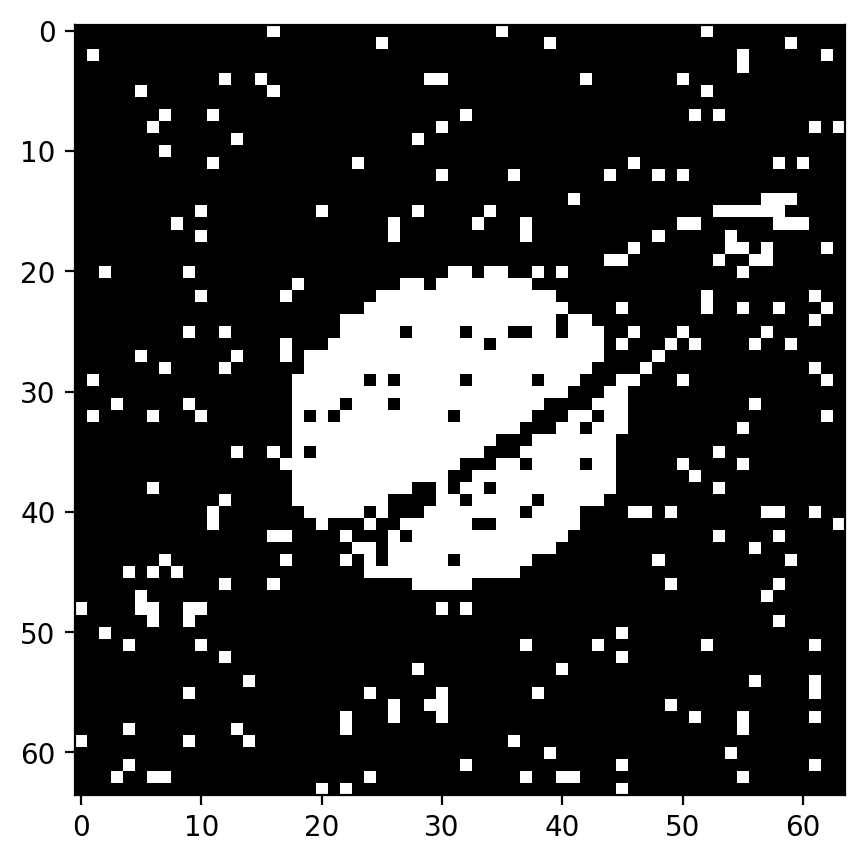

# Exercise 09 Report

## Objective
Test three Hopfield-network extensions:
1. Dilution (damaged synapses),
2. Low M/N ratio with small symbolic patterns,
3. Sparse coding with modified Hebbian rule and threshold.

## Model Used in Code
### 1) Dilution
- Start from Hopfield training on image patterns.
- Damage mask: `mask_damage = (rand > dilution)`
- Effective weights: `W = W * mask_damage`
- Asynchronous flips until stability.

### 2) Low M/N
- Four 6x6 symbolic patterns stored.
- Corrupted pattern iteratively recovered by asynchronous updates.

### 3) Sparse coding
- Binary sparse patterns (0/1), activity level `a`.
- Learning rule:
  - `W += (Y-a)*(Y-a)^T`
- Switching condition:
  - `(Y-0.5) * (W*Y - teta) < 0`
- Update: `Y = 1 - Y` for selected neurons.

## Results
The script produced a sequence of recovery snapshots across the three tests.

Early snapshots:

Intermediate/final examples:

