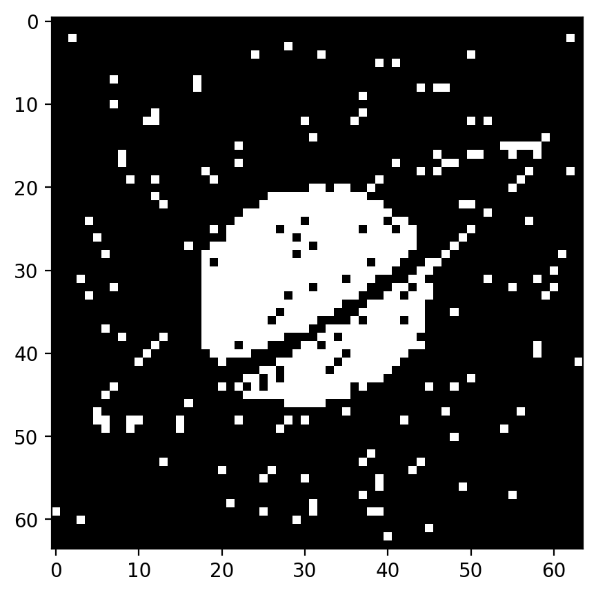
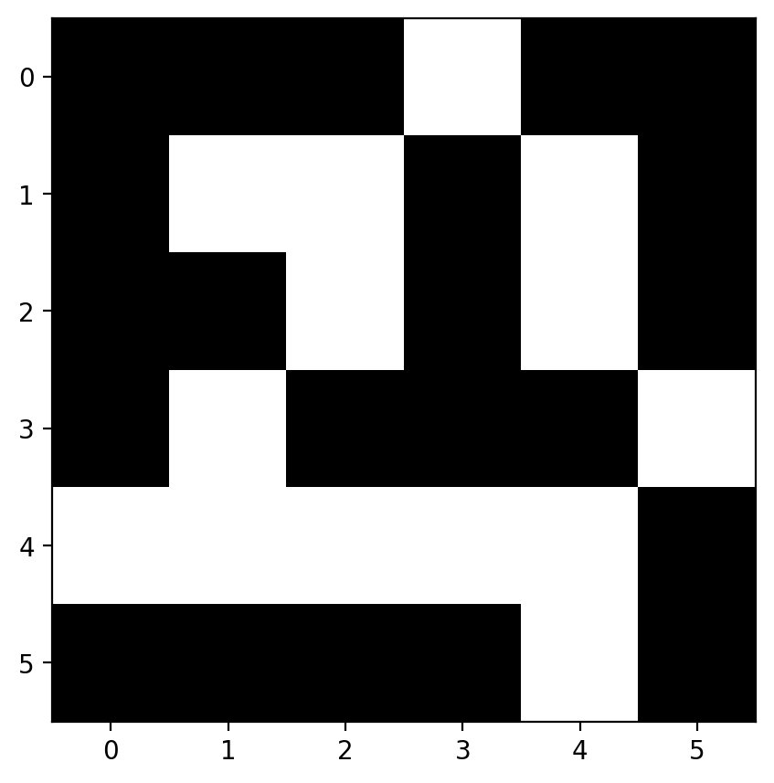
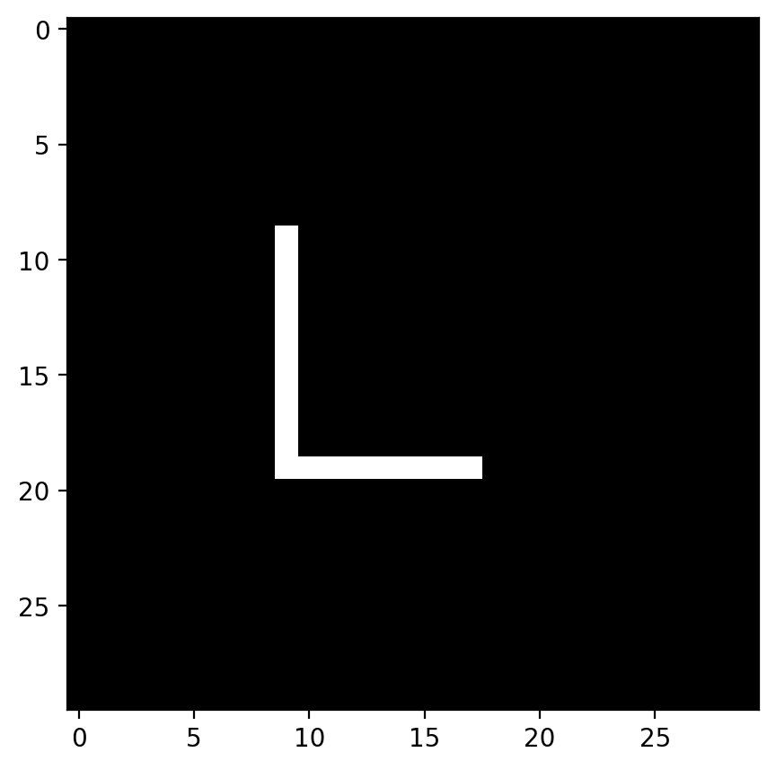

# Hopfield Extensions Report

## Objective
Test three Hopfield-network extensions:
1. Dilution (damaged synapses),
2. Low M/N ratio with small symbolic patterns,
3. Sparse coding with modified Hebbian rule and threshold.

## Model Used in Code
### 1) Dilution
- Start from Hopfield training on image patterns.
- Damage mask: `mask_damage = (rand > dilution)`
- Effective weights: `W = W * mask_damage`
- Asynchronous flips until stability.

### 2) Low M/N
- Four 6x6 symbolic patterns stored.
- Corrupted pattern iteratively recovered by asynchronous updates.

### 3) Sparse coding
- Binary sparse patterns (0/1), activity level `a`.
- Learning rule:
  - `W += (Y-a)*(Y-a)^T`
- Switching condition:
  - `(Y-0.5) * (W*Y - teta) < 0`
- Update: `Y = 1 - Y` for selected neurons.

### Figure Timeline
- **Fig 1-19**: Dilution experiment (image-pattern recovery with damaged synapses).
- **Fig 20-31**: Low M/N experiment (6x6 symbolic patterns, including intermediate and spurious states).
- **Fig 32-39**: Sparse-coding experiment (0/1 neurons, modified Hebbian learning, thresholded updates).

### Visual Gallery
**Figure 1 - Dilution: Training Patterns**

  

**Figure 20 - Low M/N: Intermediate Recovery State**

  

**Figure 30 - Low M/N: Convergence with Spurious Components**

  

**Figure 39 - Sparse Coding: Final Converged Attractor**

  

Display width is normalized for readability; original figure resolution is unchanged.

### Notes For Selected Figures
1. **Fig 1** shows the training images used in the dilution test.
2. **Fig 20** shows a low M/N intermediate state with partial structure.
3. **Fig 30** shows low M/N convergence toward an attractor, with distortion due to interference/spurious components.
4. **Fig 39** is the final stable state of the sparse-coding test.

## Sparse Pattern Recovery Interpretation
This result comes from the sparse-pattern experiment in Part 3 of the code.

### What It Represents
- White pixels are active neurons (`1`), black pixels are inactive neurons (`0`).
- The stored target is `X1`, an `L`-shaped sparse pattern on a 30x30 grid.
- The initial state is a perturbed version of `X1` with about 15% random flips (`perc = 0.15`).

### Why It Converges To This Shape
- Training uses the sparse Hebbian rule `W = sum((Yk-a)(Yk-a)^T)` with `a = 0.02`.
- Update eligibility is computed by `(Y - 0.5) * (WY - teta) < 0` with `teta = 8`.
- One unstable neuron is flipped at a time: `Y_i = 1 - Y_i`.
- The loop stops when `L = 0`, where `L` is the number of unstable neurons.

### Convergence Interpretation
- Frames are plotted when `L % 25 == 0`, so a frame may be captured exactly at `L = 0`.
- When `L = 0`, the network has reached a stable attractor for this run.
- The recovered `L` indicates successful associative recall from noisy input.
- Small isolated white dots can remain depending on threshold/noise and are interpreted as residual spurious activations.

