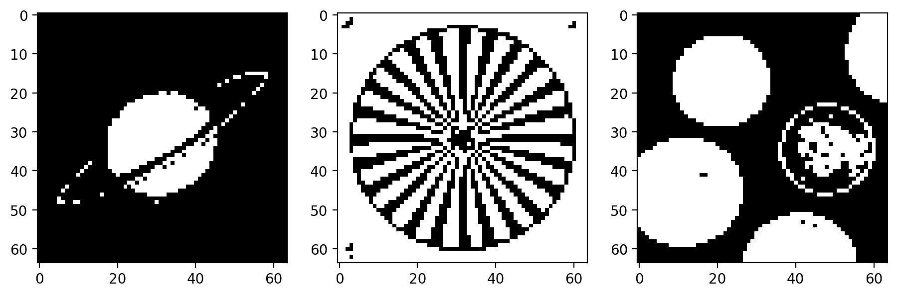
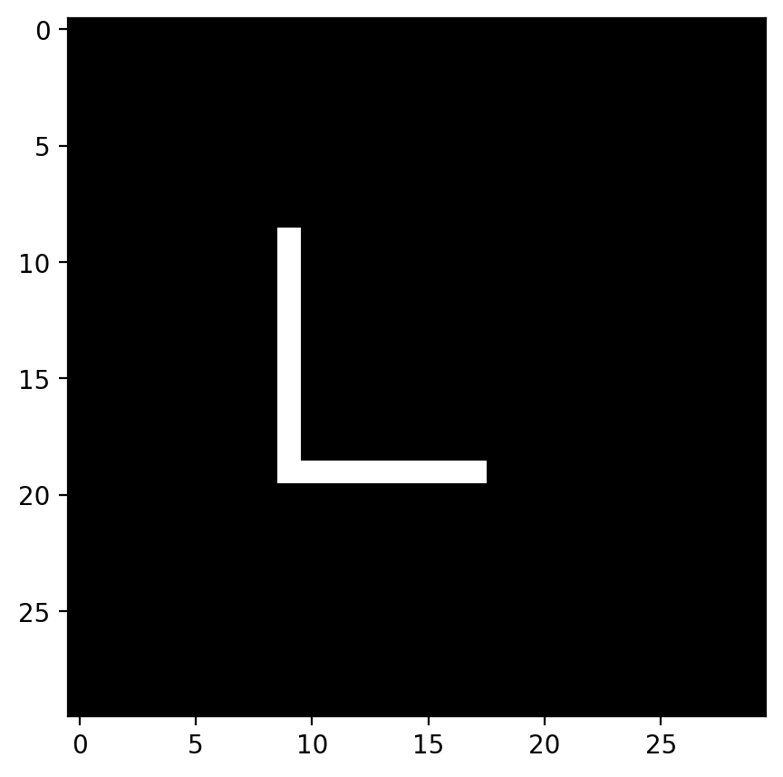

# Hopfield Model Extensions

## Overview
This project explores three extensions of the classical Hopfield network:

1. **Dilution of synapses**, to simulate damaged or missing connections;
2. **Low M/N ratio**, using a very small network storing a few handcrafted letter patterns;
3. **Sparse patterns**, using neurons with values in `{0,1}` and a modified Hebbian rule.

The aim is to understand how Hopfield behavior changes when standard assumptions are modified.

---

## Theoretical Background
The standard Hopfield network is an **auto-associative memory** made of binary neurons with recurrent feedback. In the classical setup, neuron states are in `{-1,+1}`, the synaptic matrix is symmetric, and the state is updated asynchronously one neuron at a time.

For multiple stored patterns, the Hebbian matrix is:

`W = sum_{p=1..M} (Y^(p) * (Y^(p))^T)`

Key limitations of the model:

- memory capacity is limited,
- highly correlated patterns worsen recall and may generate spurious states.

This module extends that standard model in three directions:

- synaptic dilution,
- low-M/N storage in a tiny network,
- sparse `{0,1}` coding with modified learning and thresholding.

---

## Auxiliary Functions Used in the Code
The script uses:

- `im2bw(I, th_value=128)` -> grayscale to binary `{0,1}`;
- `from_mtx_to_array(I)` -> matrix to vector;
- `from_array_to_mtx(V)` -> vector back to matrix.

These helpers simplify vector-based Hopfield dynamics while keeping visualization in 2D.

---

# Part 1 - Dilution

## Objective
The first extension studies **damaged or missing synapses**. Starting from the image-based Hopfield setup of module 06, a fraction of synaptic weights is set to zero to simulate damage. The goal is to check whether corrupted memories are still recoverable.

## Preprocessing
The code loads:

- `saturn`
- `vertigo`
- `coins`

from `imdemos.mat`.

Each image is:

1. thresholded at `128`,
2. converted from `{0,1}` to `{-1,+1}`,
3. reduced from `128x128` to `64x64` via even row/column sampling,
4. vectorized for Hopfield storage.

## Model
Three patterns are stored with standard Hebbian learning:

`W = Y1*Y1^T + Y2*Y2^T + Y3*Y3^T`

Then a random binary mask is applied to `W`, forcing many synapses to zero (dilution).

A corrupted stored image is used as initial state, and asynchronous recovery is run by repeatedly:

- finding unstable neurons,
- selecting one unstable neuron at random,
- updating only that neuron,
- recomputing the unstable set.

## Interpretation
If recovery succeeds, memory is robust to moderate synaptic loss. If dilution is too strong, convergence may fail or end in an incorrect attractor.

---

# Part 2 - Low M/N Ratio

## Objective
The second extension uses a very small Hopfield network with:

`N = 6 * 6 = 36`

Four handcrafted letter-like patterns are stored to observe sensitivity to correlation and possible spurious attractors.

## Stored Patterns
The code defines four `6x6` patterns in `{-1,+1}`. Because the network is tiny, pattern placement and overlap strongly affect attractor structure.

## Procedure
- visualize four stored patterns,
- select one and corrupt it,
- store all four with Hebbian learning,
- run asynchronous recovery to convergence.

## Interpretation
In this small regime, basins are sensitive and spurious convergence is more likely when patterns overlap structurally. A full study would repeat the test many times and estimate stored-pattern vs spurious convergence frequency.

---

# Part 3 - Sparse Patterns

## Objective
The third extension switches neuron states from `{-1,+1}` to `{0,1}` and uses sparse activity. This changes both learning and update rules.

## Stored Patterns
Three sparse `30x30` binary images are created manually. The code uses:

`a = 0.02`

and sparse Hebbian learning:

`W_ij = sum_p (y_i^(p) - a) * (y_j^(p) - a)`

## Thresholded Update Rule
The sparse case uses a shared threshold `teta` and a modified switching condition:

`(Y - 0.5) * (W*Y - teta) < 0`

This identifies neurons whose current binary state is inconsistent with thresholded local field dynamics.

## Procedure
- build three sparse patterns,
- corrupt one by toggling a fraction of pixels,
- train with sparse Hebbian rule,
- recover asynchronously with `teta = 8`.

## Interpretation
Sparse recovery depends strongly on threshold selection. Too low or too high thresholds can degrade recall. A complete study would sweep threshold values and compare reconstruction quality.

---

## Main Observations
Across all three sections:

- **Dilution** tests robustness under synaptic damage,
- **Low M/N** shows sensitivity to correlation and spurious states in tiny networks,
- **Sparse coding** modifies attractor dynamics and needs careful threshold tuning.

---

## Relation to Hopfield Theory
This implementation follows core Hopfield principles:

1. asynchronous dynamics supports convergence,
2. multiple stored patterns can interfere and create spurious equilibria,
3. correlated patterns reduce recall quality,
4. sparse representations can reduce overlap between memories.

---

## Limitations of the Current Script
This is a strong qualitative implementation, but not a full systematic study. In particular:

- dilution is shown for a selected damage level rather than a full sweep,
- low-M/N does not estimate spurious-state frequency statistically,
- sparse mode uses a selected threshold rather than full threshold search.

---

## Conclusion
This project extends the classical Hopfield model in three meaningful directions.

Results show that Hopfield memory is robust but sensitive to structural changes:

- excessive synapse removal harms recall,
- correlated small-network memories can yield unstable or spurious behavior,
- sparse coding needs modified learning and proper threshold choice, but can improve separation.

Overall, the script gives a clear experimental view of Hopfield behavior beyond the simplest setup.

---

## Figure Gallery
**Figure 1 - Dilution: Preprocessed image patterns**

  

**Figure 2 - Dilution / low-MN transition snapshot**

  

**Figure 3 - Intermediate recovery snapshot**

  

**Figure 4 - Sparse-pattern converged output**

  

Display width is normalized for readability; original figure resolution is unchanged.
