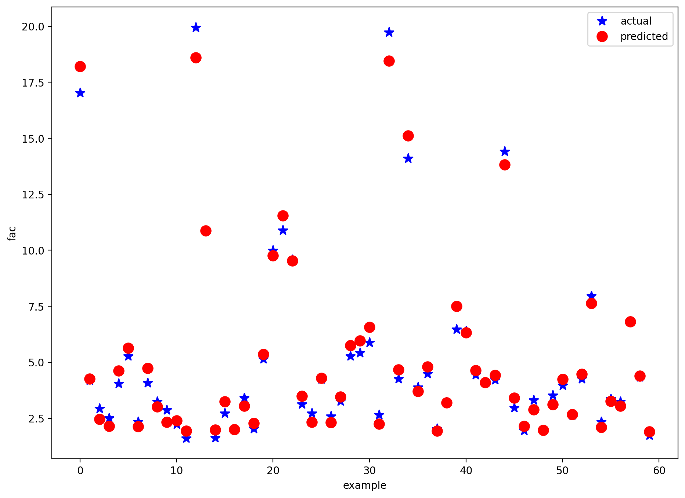
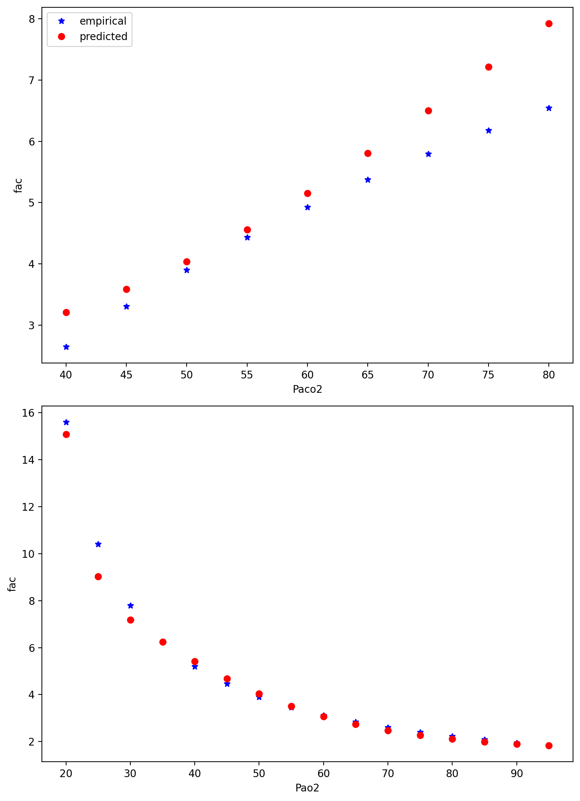

# Supervised Learning Report

## Objective
Train and evaluate a two-layer neural network (one hidden layer) to model the nonlinear relationship between chemoreceptor firing rate (`fac`) and blood gas pressures (`Pao2`, `Paco2`).

## Method Summary
Two solution variants are included:
- MATLAB pipeline (`supervised_learning.m`)
- Python pipeline (`supervised_learning.py`)

Python workflow in this repository:
- load `chemo.mat` (`Pao2`, `Paco2`, `fac`),
- train a 2-hidden-unit network with sigmoid activations by backpropagation,
- track training error over epochs,
- compare predicted vs experimental responses,
- test generalization against theoretical open-loop curves.

## Model Used in Code
- Hidden layer: 2 neurons (`u1`, `u2`) with sigmoid output.
- Output layer: 1 neuron (`usc`) with sigmoid output.
- Learning rule: online gradient-based backpropagation.
- Training horizon: controlled by `EX10_MAX_STEPS` (default `80000`).
- Learning rate: `gamma = 0.001`.

## Results
The script exports three figures (`exercise10_fig_001` to `exercise10_fig_003`).

### Figure Timeline
- **Fig 1**: training error versus epochs (convergence trend).
- **Fig 2**: measured `fac` vs model-predicted `fac` on dataset samples.
- **Fig 3**: generalization checks against theoretical relationships:
  - varying `Paco2` at fixed `Pao2`,
  - varying `Pao2` at fixed `Paco2`.

### Visual Gallery
**Figure 1 - Training Error Curve**

  

**Figure 2 - Actual vs Predicted Output**

  

**Figure 3 - Generalization Against Theoretical Curves**

  

Display width is normalized for readability; original figure resolution is unchanged.

## Interpretation
### Training Behavior
- The error curve confirms iterative improvement under backpropagation.
- Random initialization can change exact trajectory and final residual error between runs.

### Fit Quality
- Predicted values follow the measured trend, indicating the network captures the main nonlinear dependence.
- Remaining mismatch reflects limited hidden capacity (2 units) and data variability.

### Generalization
- The model reproduces the qualitative trend of theoretical open-loop behavior for both pressure sweeps.
- This supports using the learned mapping for closed-loop-to-open-loop characteristic approximation.
