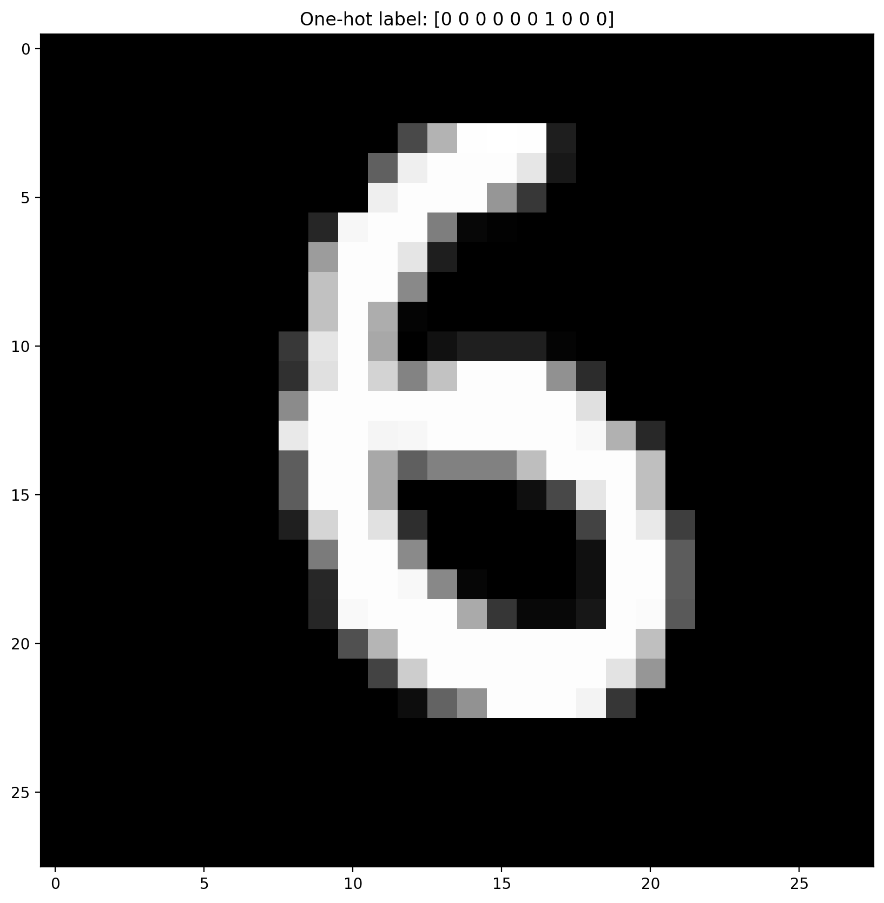
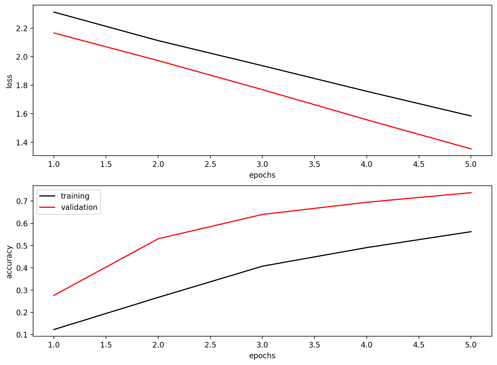
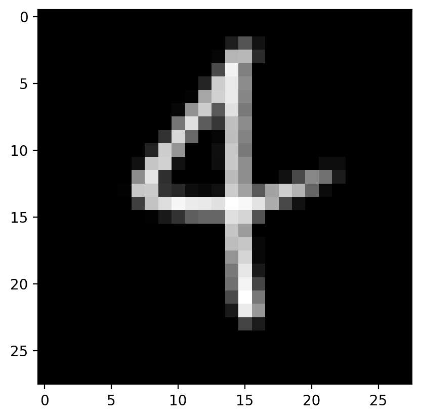

# MNIST Classification Report

## Objective
Supervised handwritten-digit classification using deep neural networks (MNIST), including training/validation analysis and test evaluation.

## Model Used in Code
- Input preprocessing:
  - Scale pixel values to [0, 1].
  - Reshape to `(N, 28, 28, 1)`.
- One-hot encoding implemented manually (`to_one_hot`).
- Dense model:
  - `Flatten -> Dense(128, relu) -> Dropout(0.25) -> Dense(64, relu) -> Dropout(0.25) -> Dense(10, softmax)`
- Loss:
  - categorical crossentropy.
- Optimizer:
  - SGD with momentum.

Run note:
- To keep runtime practical, quick settings were used:
  - `EX11_MAX_EPOCHS=5`
  - `EX11_QUICK_TRAIN_EXAMPLES=12000`
  - `EX11_QUICK_TEST_EXAMPLES=2000`

## Results
Sample training image:

Training/validation curves:

Custom digit test image and prediction:

