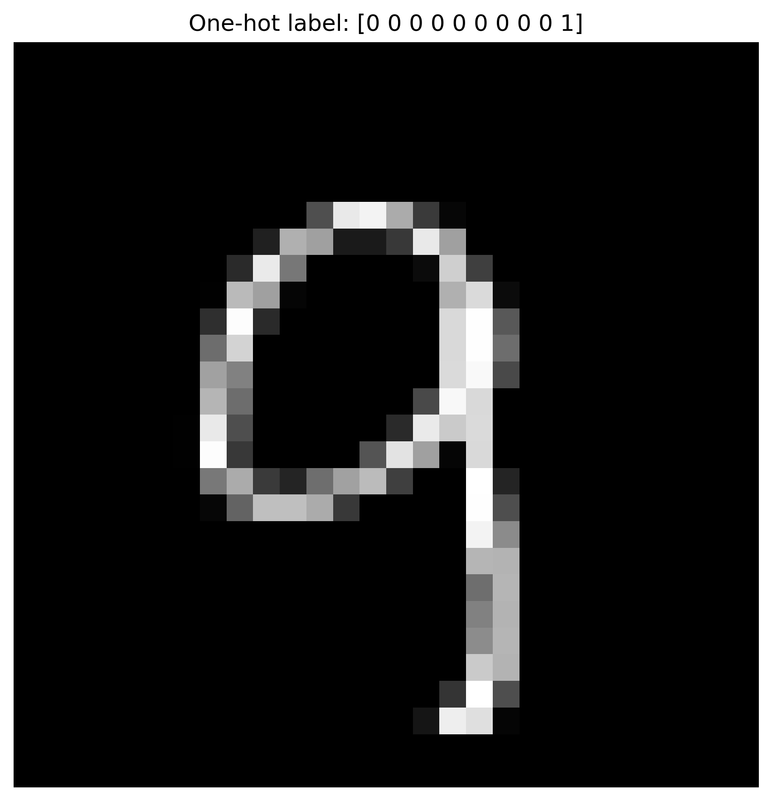
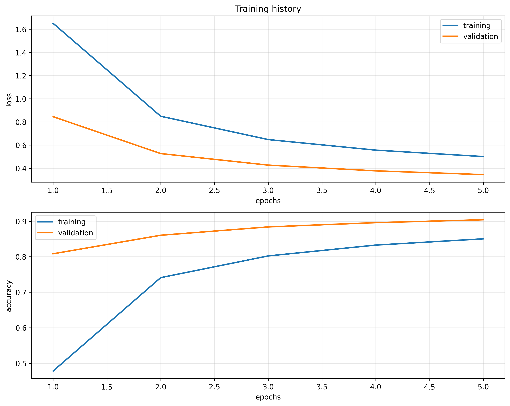
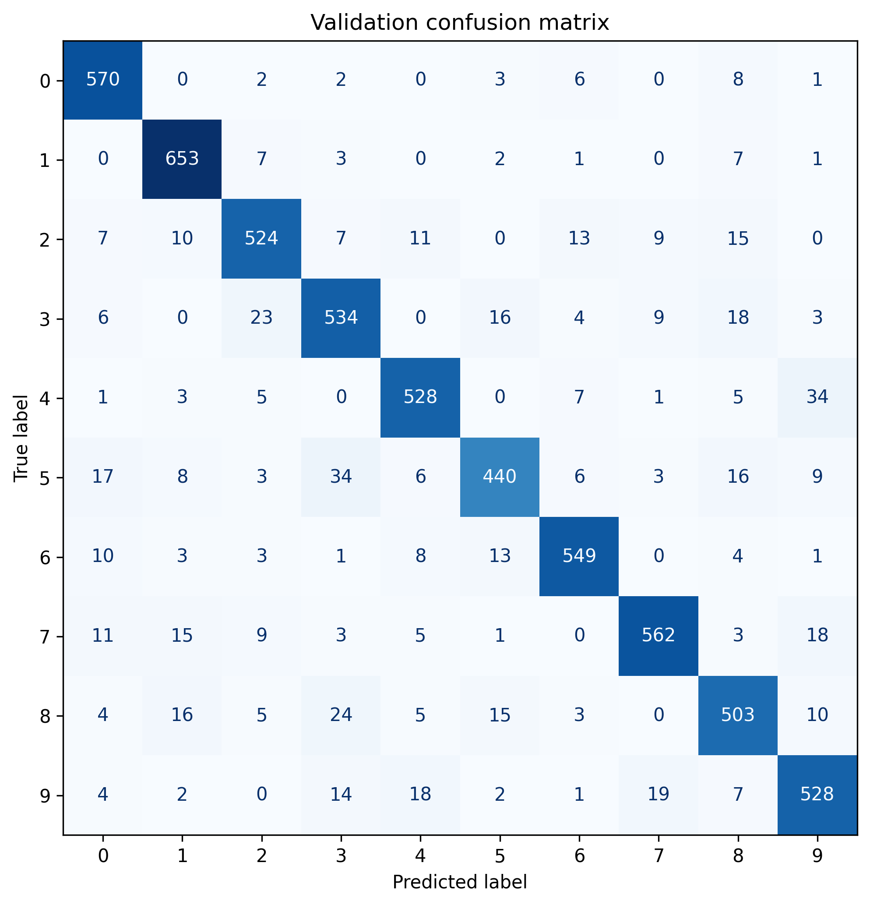
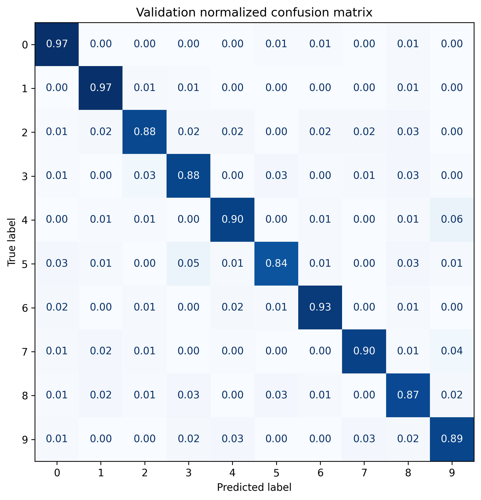
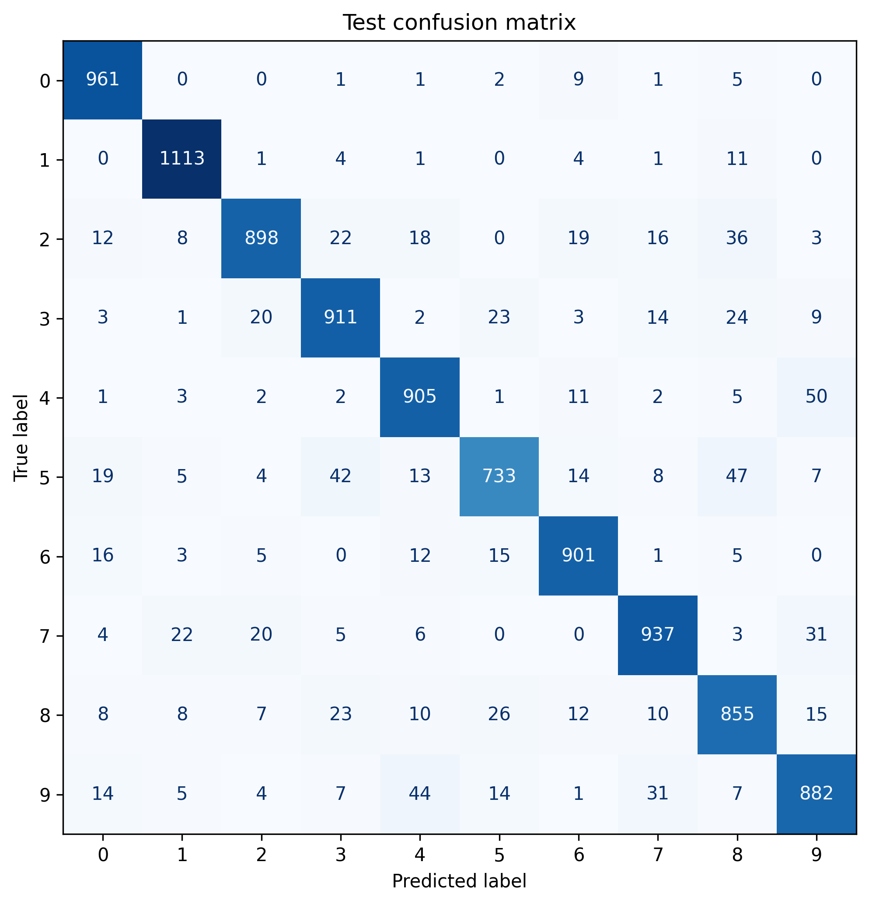
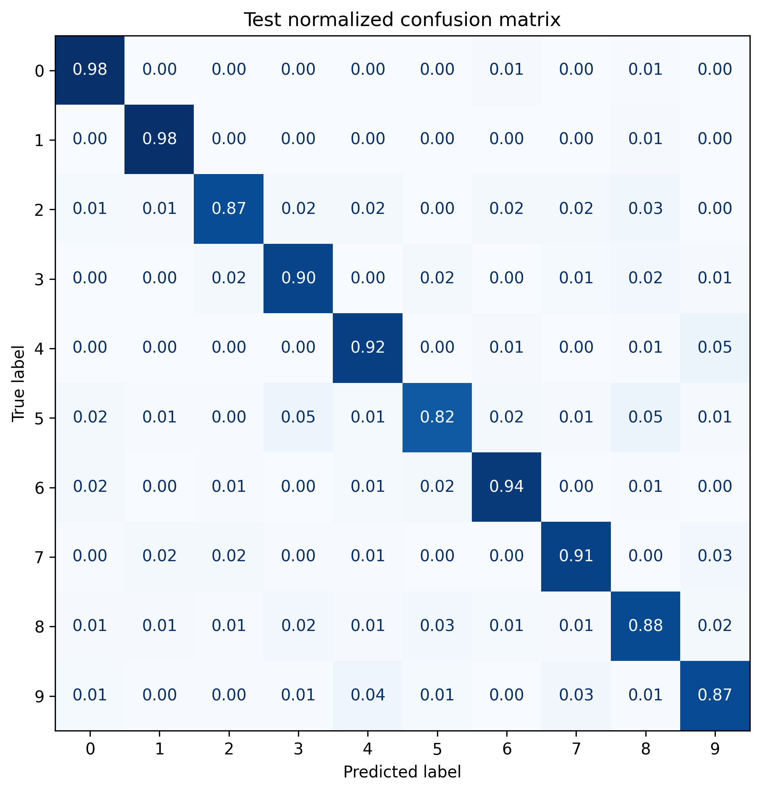
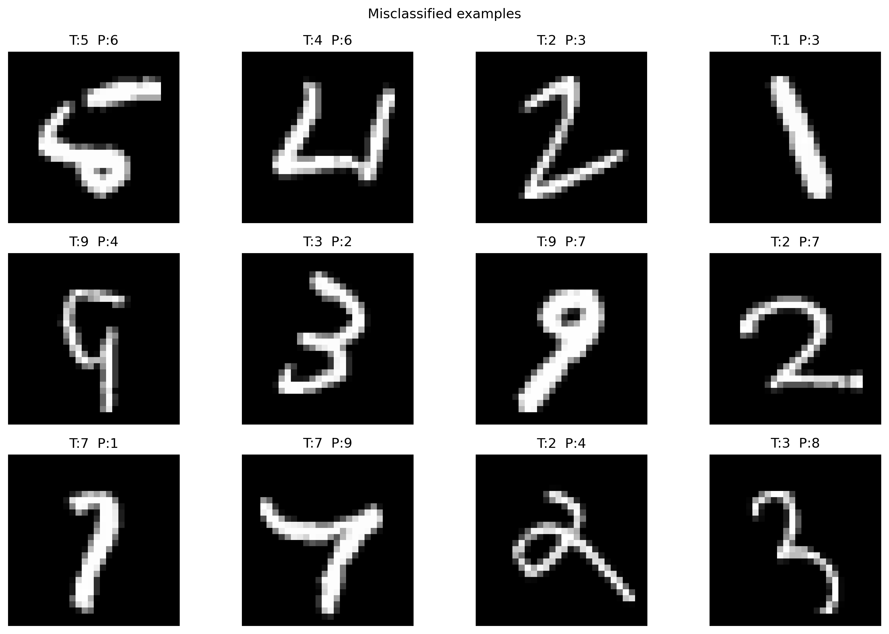
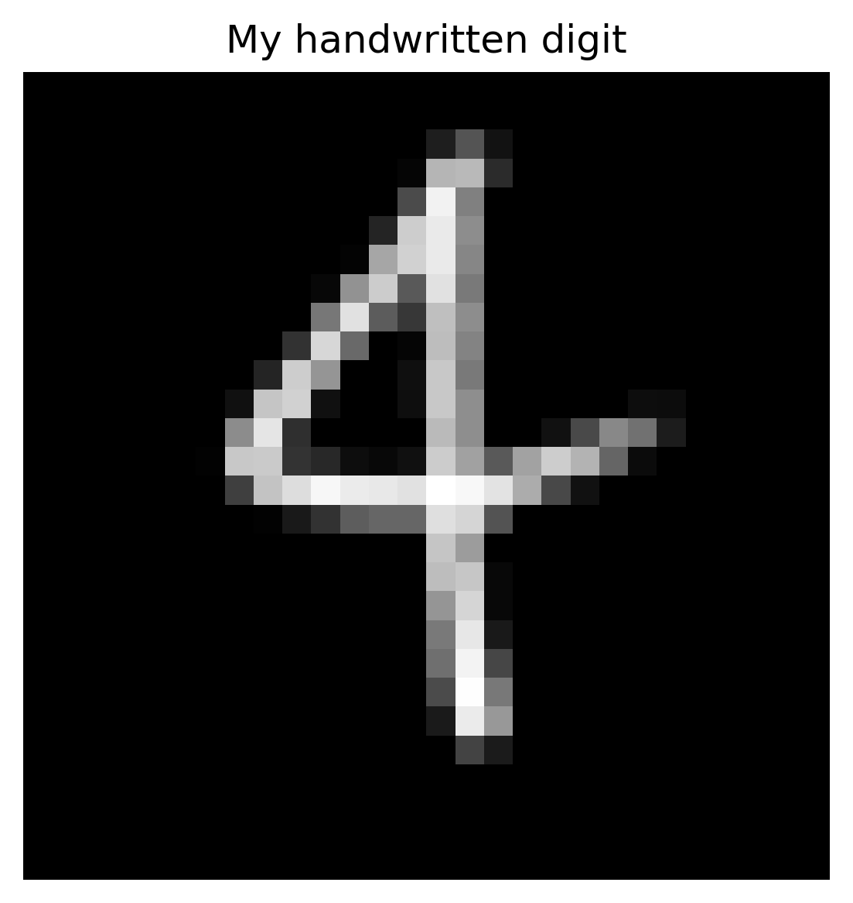

# MNIST Classification Report

## Overview

This project addresses handwritten digit classification on the MNIST dataset. The task is a 10-class classification problem, where each grayscale image must be assigned to one class from 0 to 9. MNIST contains 60,000 training images and 10,000 test images, each with size 28x28.

The implementation follows the supervised-learning workflow on dense and convolutional neural networks. In this report, the main results are presented for the dense model, while the code also supports the convolutional version, confusion-matrix analysis, prediction on a custom digit, and CNN feature visualization.

---

## Objective

The goal is to build and evaluate a neural network for handwritten digit recognition.

The workflow includes:

- loading the MNIST dataset,
- scaling the images from 0-255 to 0-1,
- reshaping them from 28x28 to 28x28x1,
- converting labels to one-hot encoding,
- defining the neural network,
- training with stochastic gradient descent and momentum,
- monitoring training and validation performance,
- saving the best model according to validation loss,
- evaluating the model on validation and test data through predicted probabilities, predicted labels, accuracies, and confusion matrices.

The convolutional extension follows the same pipeline and adds custom-digit prediction, learned-kernel visualization, and feature-map visualization.

---

## Dataset and Preprocessing

The dataset used in this project is MNIST, composed of grayscale handwritten digits. Each image has one channel, so after preprocessing the input shape becomes 28x28x1.

The preprocessing pipeline includes:

- loading images and labels,
- splitting data into training, validation, and test sets,
- scaling pixel values to the 0-1 range,
- adding the singleton channel dimension,
- converting labels to one-hot vectors through a custom function.

This setup supports validation-based model selection and proper training monitoring through both loss and accuracy curves.

---

## Dense Model Architecture

The dense baseline network is:

- `Flatten`
- `Dense(128, relu)` + `Dropout(0.25)`
- `Dense(64, relu)` + `Dropout(0.25)`
- `Dense(10, softmax)`

This architecture is used as the main reference model in the report.

---

## Training Procedure

The training configuration is:

- optimizer: SGD with momentum,
- learning rate: 0.001,
- momentum: 0.9,
- batch size: 128,
- maximum epochs: up to 100 (or lower when configured),
- loss: categorical cross-entropy.

The best model is selected using validation loss and saved to disk. Training/validation loss and accuracy are plotted to inspect convergence and possible overfitting.

---

## Evaluation Strategy

After training, the best saved model is reloaded and evaluated on validation and test data. The network outputs class probabilities, and the predicted label is obtained with `argmax`.

Evaluation includes:

- accuracy per split,
- classification report (precision, recall, f1-score),
- confusion matrices (raw and normalized),
- analysis of misclassified examples.

The confusion matrix helps identify which digit pairs are most frequently confused, while the normalized version highlights class-wise behavior.

---

## Results

### Figure 1 - Example MNIST input


### Figure 2 - Training and validation history


### Figure 3 - Validation confusion matrix (raw)


### Figure 4 - Validation confusion matrix (normalized)


### Figure 5 - Test confusion matrix (raw)


### Figure 6 - Test confusion matrix (normalized)


### Figure 7 - Misclassified test examples


### Figure 8 - Custom handwritten digit prediction input


---

## Custom Digit Evaluation

The script includes prediction on a user-provided digit image loaded through `load_my_digit.py`. The image is preprocessed to match MNIST format and then passed to the model for class prediction and probability output.

This step helps check generalization beyond the original MNIST distribution.

---

## CNN Extension

The code also supports a convolutional model with convolution and pooling stages before classification.

When CNN mode is enabled, the pipeline can include:

- dense vs CNN performance comparison,
- custom-digit evaluation,
- visualization of first-layer kernels,
- visualization of first-layer feature maps.

CNN models are generally more suitable for image classification because they exploit local spatial structure.

---

## Discussion

The dense model provides a strong and interpretable baseline for MNIST. The CNN extension is typically more aligned with image-structure learning and can improve feature extraction.

Confusion matrices and misclassified examples provide important diagnostic insight beyond a single accuracy value.

---

## Conclusion

This project implements a complete MNIST supervised-learning workflow:

- preprocessing and one-hot encoding,
- dense baseline training with dropout and SGD momentum,
- validation-based model selection,
- evaluation with classification metrics and confusion matrices,
- custom-digit prediction,
- optional CNN-based extension and feature visualization.

The result is a complete and reproducible classification pipeline with both quantitative and visual analysis.

---

## How to run

Run from the module folder:

```bash
python mnist_classification.py
```
