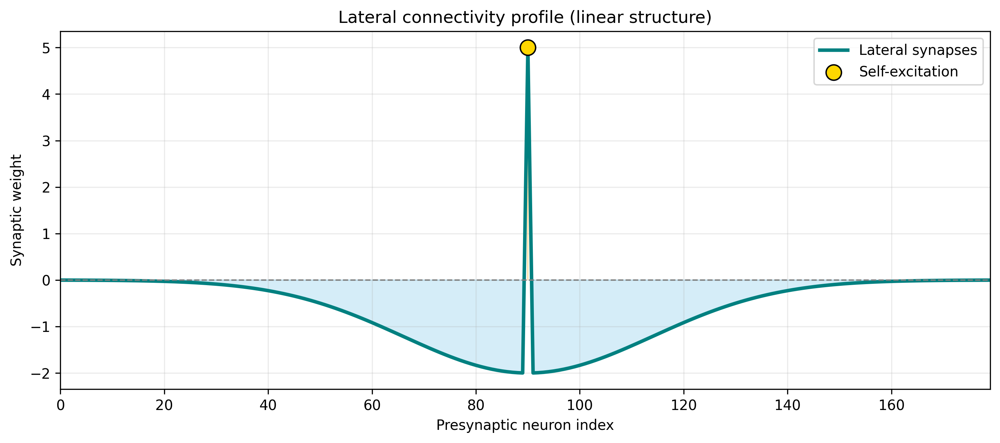
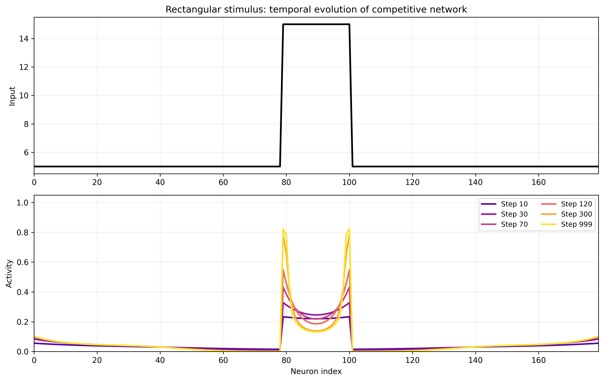
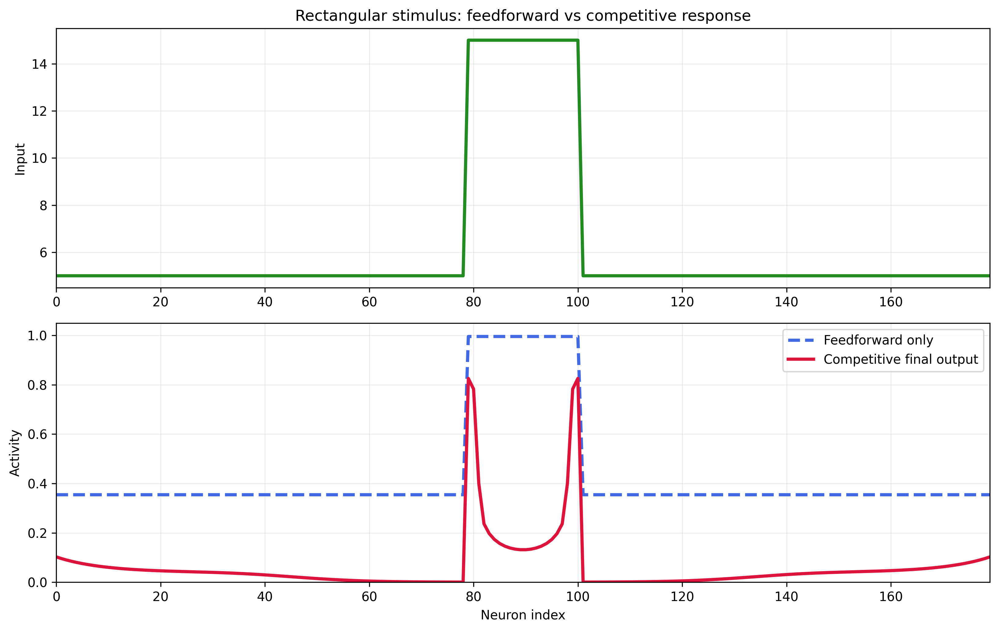
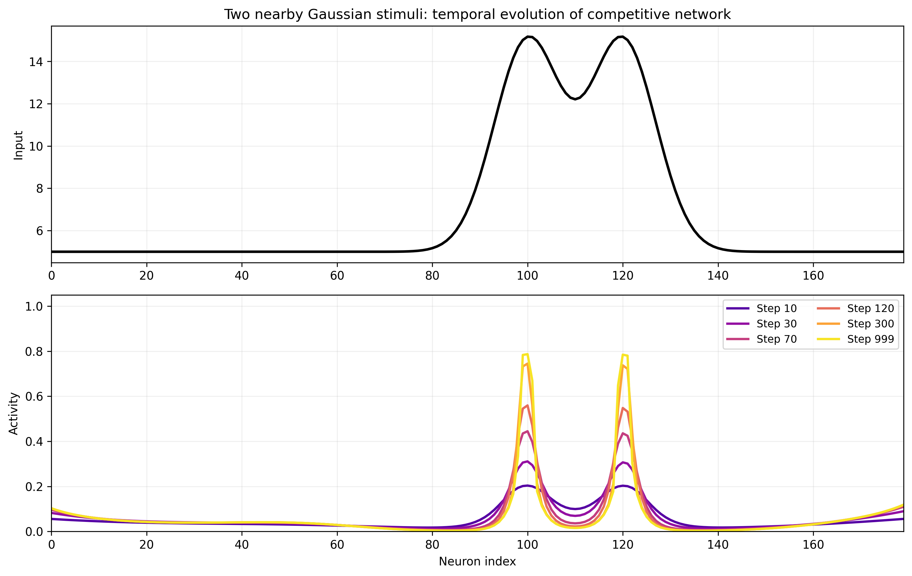
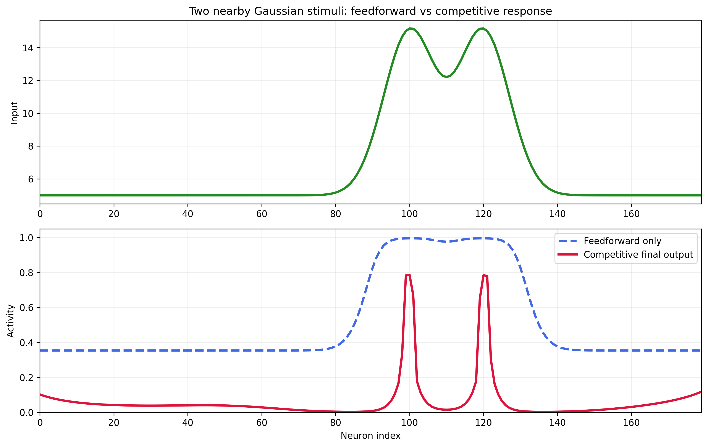
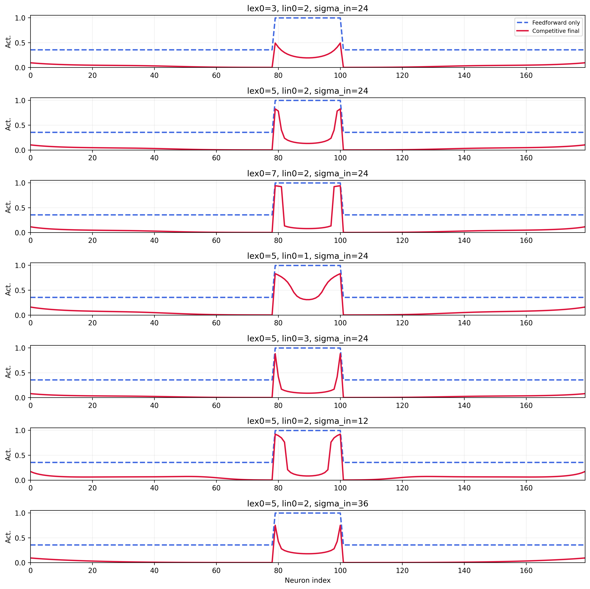

# Competitive Networks with Lateral Inhibition

## Overview
This project investigates the behavior of a **competitive neural network** composed of `N = 180` neurons arranged in a one-dimensional chain.  
Each neuron receives:

- one external input,
- one self-excitatory lateral connection,
- inhibitory lateral connections from all the other neurons.

The strength of inhibition decreases with distance according to a **Gaussian law**.  
The network is simulated through **Euler's method**, assuming **first-order dynamics** and a **sigmoidal activation function**.  
The main purpose is to study how lateral inhibition modifies the output of the network compared with a purely feedforward response.

---

## Objectives
The goals of this project are:

1. to simulate the dynamic evolution of a competitive network with lateral inhibition;
2. to analyze the effect of **local competition** on the activity profile;
3. to test the network with:
- a **rectangular stimulus** for contrast enhancement,
- **two nearby Gaussian stimuli** immersed in a high background for improved resolution;
4. to compare the recurrent competitive response with the **feedforward-only output**;
5. to observe how the behavior changes when synaptic parameters are varied.

---

## Theoretical Background
Competitive networks are recurrent systems in which neurons interact through **lateral synapses**.  
In the case considered here, each neuron has:

- a **positive self-excitation**,
- **negative lateral inhibition** toward the other neurons,
- inhibition strength that decreases with spatial distance.

When inhibition is local rather than global, the network can enhance contrast and improve separation between nearby stimuli.

Continuous-time model for neuron `j`:

`tau * dy_j(t)/dt = -y_j(t) + S(sum_{k=1..N}(l_jk * y_k(t)) + i_j - theta)`

where:

- `y_j(t)` is the activity of neuron `j`,
- `i_j` is the external input,
- `l_jk` is the lateral synaptic weight from neuron `k` to neuron `j`,
- `theta` is the threshold,
- `tau` is the time constant,
- `S(.)` is a sigmoid nonlinearity.

In the code, this system is integrated numerically with Euler's method.

---

## Model Parameters
The simulation uses the following values:

- **Number of neurons:** `N = 180`
- **Integration step:** `dt = 0.1 s`
- **Time constant:** `tau = 3 s`
- **Threshold:** `theta = 6`
- **Sigmoid slope:** `0.6`
- **Self-excitation:** `lex0 = 5`
- **Inhibitory amplitude:** `lin0 = 2`
- **Gaussian inhibitory spread:** `sigma_in = 24`
- **Connectivity structure:** `linear` (main run)

---

## Lateral Connectivity
The lateral connectivity matrix `L` is defined as:

- diagonal elements: `L[i,i] = lex0`
- off-diagonal elements: `L[i,j] = -lin0 * exp(-(d(i,j)^2) / (2 * sigma_in^2)), i != j`

where `d(i,j)` is the distance between neurons.

This produces:

- **positive self-feedback** for each neuron,
- **negative inhibitory coupling** between neurons,
- stronger inhibition for nearby neurons,
- weaker inhibition for distant neurons.

This structure implements the **local competition** case.

---

## Numerical Simulation
The state is updated with Euler's method:

`y(t+dt) = y(t) + (dt/tau) * (-y(t) + S(I + L@y(t) - theta))`

where `I` is the input vector and `y(t)` is the activity vector at time step `t`.

The output activity starts at zero and evolves over time toward a steady profile.

---

## Input Stimuli
Two input configurations are tested.

### 1. Rectangular Stimulus
A rectangular high-input region is superimposed on a constant baseline.  
This case is used to study **contrast enhancement**.

### 2. Two Nearby Gaussian Stimuli
Two close Gaussian peaks are added to a high background.  
This case is used to study **improved resolution**.

---

## Feedforward vs Competitive Response
To understand recurrence, the network output is compared with the **feedforward-only response**:

`y_ff = S(I - theta)`

This output depends only on external input and threshold, without lateral interactions.  
The competitive response includes recurrent excitation and inhibition.

---

## Results
### 1. Lateral Connectivity Profile

The first figure shows the synaptic profile entering a representative neuron.  
The central positive value corresponds to **self-excitation**, while surrounding negative values correspond to **Gaussian lateral inhibition**.

---

### 2. Rectangular Stimulus - Temporal Evolution

The temporal snapshots show how activity evolves under rectangular input.

At the beginning, output is mainly driven by external stimulus.  
As time progresses, lateral inhibition suppresses neighboring activity and makes the response more selective.  
The final activity is narrower and sharper than the initial one.

---

### 3. Rectangular Stimulus - Feedforward vs Competitive Output

The comparison shows that:

- the **feedforward-only response** stays broader and closer to the raw input profile;
- the **competitive final response** is sharper and more localized.

This indicates improved spatial selectivity through lateral inhibition.

---

### 4. Two Nearby Gaussian Stimuli - Temporal Evolution

With two nearby Gaussian peaks, activity evolves toward a more structured output.

During simulation, background activity is reduced and stronger regions are emphasized.  
The final response separates the two input peaks more clearly than initial activation.

---

### 5. Two Nearby Gaussian Stimuli - Feedforward vs Competitive Output

This figure compares the final competitive output with feedforward-only output for the double-Gaussian input.

The competitive network makes the two peaks more distinguishable, improving effective resolution.

---

### 6. Parameter Exploration

The final output is analyzed while varying:

- `lex0` (self-excitation),
- `lin0` (inhibitory strength),
- `sigma_in` (inhibitory spatial spread).

Main effects:

- increasing `lex0` reinforces dominant active regions,
- increasing `lin0` suppresses neighboring activity more strongly,
- changing `sigma_in` controls how far inhibition extends.

---

## Discussion
The simulations show that the competitive network behaves differently from a simple feedforward system.

Main observations:

- local lateral inhibition makes the response **sharper**,
- broad or diffuse activity is **suppressed**,
- nearby stimuli become **more distinguishable**,
- the final output is more selective than no-competition response.

In the rectangular case, the network enhances contrast by reducing spread around the stimulated region.  
In the double-Gaussian case, it improves resolution by separating nearby peaks.

---

## Conclusion
This project demonstrates that a recurrent competitive network with self-excitation and distance-dependent lateral inhibition can significantly reshape neural activity.

Compared with purely feedforward response, the competitive network:

- enhances contrast,
- improves separation between nearby stimuli,
- produces a more selective and structured final output.

This illustrates a key computational principle of sensory processing: **lateral inhibition sharpens neural representations and reduces redundancy**.

---

## Files Produced by the Script
The current Python script saves:

- `figures/lateral_connectivity.png`
- `figures/rectangular_evolution.png`
- `figures/rectangular_comparison.png`
- `figures/gaussian_evolution.png`
- `figures/gaussian_comparison.png`
- `figures/parameter_exploration.png`

Optional output when enabled:

- `figures/lateral_connectivity_circular.png`

---

## How to Run
Run `10_competitive_networks/competitive_model/competitive_network.py`.

The script:

1. builds the lateral connectivity matrix,
2. simulates rectangular-stimulus dynamics,
3. simulates two-nearby-Gaussians dynamics,
4. computes feedforward-only outputs,
5. saves figures used in this report,
6. optionally runs the circular-connectivity extension.
