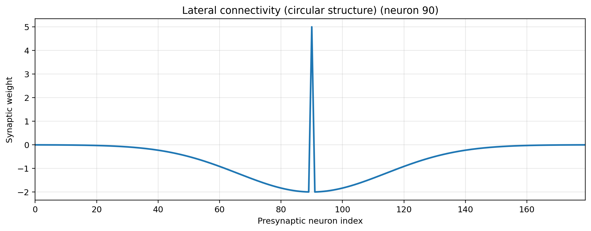
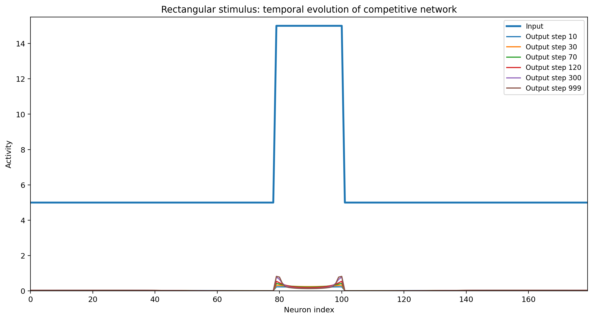
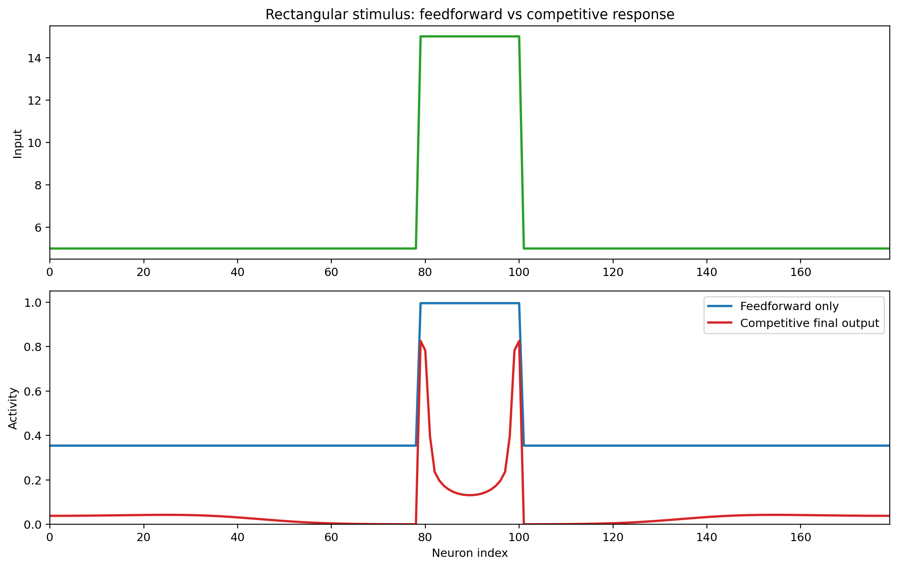
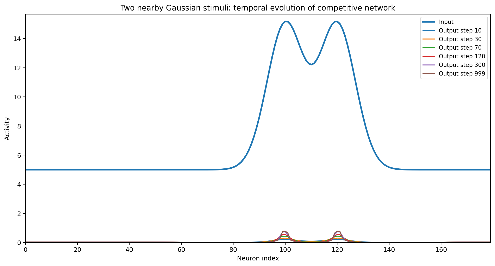
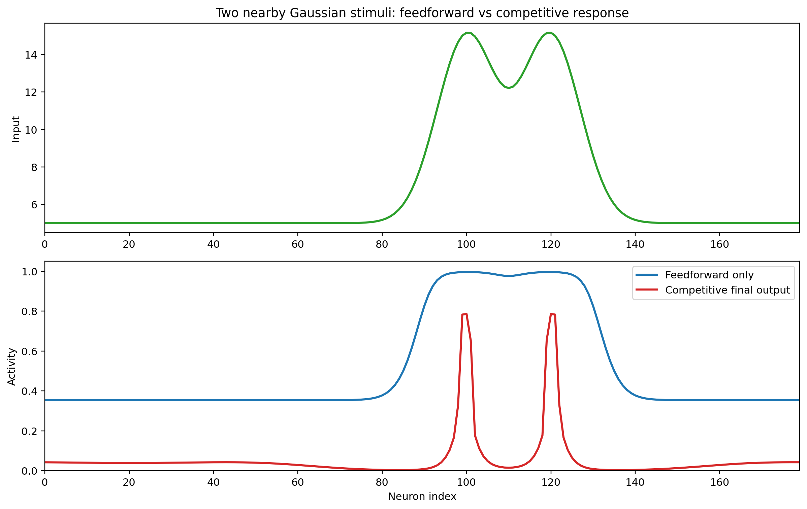
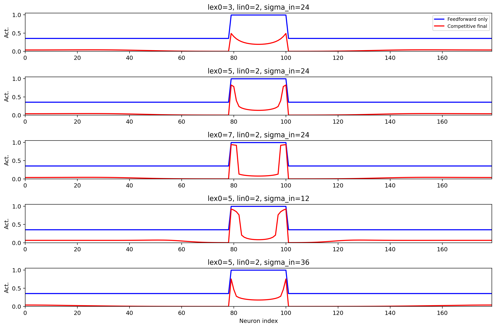

# Competitive Neural Network with Lateral Inhibition

## Overview
This project investigates the behavior of a **competitive neural network** arranged as a one-dimensional chain of neurons.  
The main goal is to study how **lateral inhibition** modifies the network response over time and how this mechanism can enhance contrast and improve the separation between nearby input regions.

Unlike a simple feedforward architecture, a competitive network includes **recurrent lateral interactions** between neurons.  
Because of these interactions, neurons do not respond independently: the activation of one unit can suppress the activity of neighboring units, leading to a more selective and structured final response.

---

## Theoretical Background
Competitive networks belong to the family of **self-organized neural systems**, where structure emerges directly from input statistics rather than from an explicit teacher signal.  
A key biological inspiration is the phenomenon of **lateral inhibition**, observed in sensory systems such as the visual system, where neighboring receptors interact to sharpen spatial contrast.

In this framework:

- each neuron receives an external input;
- each neuron also interacts with the others through lateral connections;
- the network evolves dynamically until it reaches a stable response pattern.

Depending on the structure of lateral connectivity, different behaviors can emerge:

- **global competition**, which can produce a winner-takes-all response;
- **local competition**, which emphasizes local differences and enhances contours;
- **Mexican-hat interactions**, where short-range excitation and long-range inhibition support clustered activation and topological organization.

In this model, the implementation focuses on the **local inhibitory case**, which is especially relevant for studying **contrast enhancement**.

---

## Network Model
The network contains `N = 180` neurons arranged along a 1D chain.  
Each neuron receives:

1. an external input profile `I_j`,
2. recurrent lateral input from the other neurons.

The temporal evolution is modeled through a **first-order dynamical system** with sigmoidal activation:

`tau * dy_j(t)/dt = -y_j(t) + S(sum_{k=1..N}(l_jk * y_k(t)) + i_j)`

where:

- `y_j(t)` is the activity of neuron `j`,
- `i_j` is the external input,
- `l_jk` is the lateral interaction from neuron `k` to neuron `j`,
- `S(.)` is a sigmoid nonlinearity,
- `tau` is the time constant.

### Lateral Interaction Matrix
The implemented lateral matrix follows a **distance-dependent inhibitory law**:

- **self-excitation** on the diagonal:
  `L[i,i] = Lex0`

- **Gaussian inhibition** for different neurons:
  `L[i,j] = -Lin0 * exp(-(d(i,j)^2) / (2 * sigma_in^2)),  i != j`

where `d(i,j)` is the neuron-to-neuron distance.  
A **circular distance** option is used so that the chain behaves as a ring and edge effects are reduced.

### Activation Function
The neuron nonlinearity is a sigmoid:

`S(x) = 1 / (1 + exp(-k * (x - x0)))`

This keeps the response bounded and introduces a soft thresholding effect.

### Numerical Integration
The differential equation is solved with an **Euler discretization**:

`x(:,k+1) = x(:,k) + dt * (1/tau) * (-x(:,k) + S(I + L*x(:,k) - threshold))`

This allows the progressive observation of network activity from the initial state to its steady response.

---

## Simulation Objective
The purpose of the simulation is not only to obtain the final output, but also to analyze **how competition reshapes the activity profile over time**.

More specifically, the model aims to show that:

- lateral inhibition suppresses broadly distributed activity,
- neighboring neurons compete with each other,
- the response becomes more selective than the original feedforward activation,
- contours and transitions in the input profile become more evident.

This is the computational basis of **contrast enhancement**.

---

## Results
### Figure Timeline
- **Fig 1**: lateral connectivity profile (self-excitation + distance-dependent inhibition).
- **Fig 2**: rectangular-stimulus temporal evolution.
- **Fig 3**: rectangular-stimulus feedforward vs competitive final response.
- **Fig 4**: two-Gaussian-stimuli temporal evolution.
- **Fig 5**: two-Gaussian-stimuli feedforward vs competitive final response.
- **Fig 6**: parameter exploration (`lex0`, `lin0`, `sigma_in`) for final competitive output.

### Visual Gallery
**Figure 1 - Lateral Connectivity Profile**

  

**Figure 2 - Rectangular Stimulus: Temporal Evolution**

  

**Figure 3 - Rectangular Stimulus: Feedforward vs Competitive**

  

**Figure 4 - Two Nearby Gaussian Stimuli: Temporal Evolution**

  

**Figure 5 - Two Nearby Gaussian Stimuli: Feedforward vs Competitive**

  

**Figure 6 - Parameter Exploration**

  

Display width is normalized for readability; original figure resolution is unchanged.

### Notes On Results
1. The lateral profile confirms a strong positive diagonal term (`lex0`) and Gaussian inhibitory surround.
2. In both stimulus families, the competitive dynamics sharpen the response compared with feedforward-only output.
3. The Gaussian pair case shows improved separation of nearby peaks, illustrating enhanced resolution.
4. Parameter exploration shows how stronger self-excitation or narrower inhibition kernels change final selectivity.

---

## Interpretation
The essential idea behind this model is that neurons should not respond in isolation.  
When one neuron becomes active, it inhibits its neighbors; as a result, only the most strongly supported regions preserve a high response.

This mechanism enables the network to:

- reduce redundancy,
- produce sparse or semi-sparse responses,
- enhance local differences,
- approximate biologically plausible sensory preprocessing.

In sensory systems, this type of processing is useful because the nervous system is often more interested in **changes, boundaries, and contrasts** than in absolute uniform intensity values.

---

## Relation to Broader Competitive-Network Theory
This model represents one specific case of a broader class of competitive systems.

- If inhibition is global and strong, the system can evolve toward a **winner-takes-all** regime, where only one neuron remains strongly active.
- If inhibition decreases with distance, as in this implementation, the result is **local competition** and **contrast enhancement**.
- If short-range excitation and long-range inhibition are both present, the network exhibits a **Mexican-hat** organization, which can support activity clusters and, in higher-dimensional grids, the formation of **topological maps**.

Therefore, this model is a useful intermediate step between simple recurrent inhibition and more advanced self-organizing neural systems.

---

## Conclusion
This simulation demonstrates that adding lateral inhibition to a neural network fundamentally changes its computational behavior.

Competitive interactions transform the network from a passive input-response system into a dynamical processor able to:

- sharpen activity profiles,
- suppress weaker neighboring responses,
- enhance contrast,
- improve spatial selectivity.

The results confirm that even a relatively simple first-order recurrent model can reproduce an important computational principle observed in biological sensory systems.

## Files
- `10_competitive_networks/` -> source code for the simulation
- `competitive_model/competitive_network.py` -> updated competitive-network implementation
- `figures/competitive_networks_fig_001.png` -> lateral connectivity profile
- `figures/competitive_networks_fig_002.png` -> rectangular stimulus temporal evolution
- `figures/competitive_networks_fig_003.png` -> rectangular feedforward vs competitive comparison
- `figures/competitive_networks_fig_004.png` -> Gaussian pair temporal evolution
- `figures/competitive_networks_fig_005.png` -> Gaussian pair feedforward vs competitive comparison
- `figures/competitive_networks_fig_006.png` -> parameter exploration summary
- `figures/competitive_networks_manifest.json` -> manifest of generated figures

---
## Key Takeaway
A competitive network with local lateral inhibition does not merely pass information forward: it **reorganizes** the response so that relevant spatial differences become more visible.  
This is why lateral inhibition is a fundamental mechanism in both computational neuroscience and biological sensory processing.
