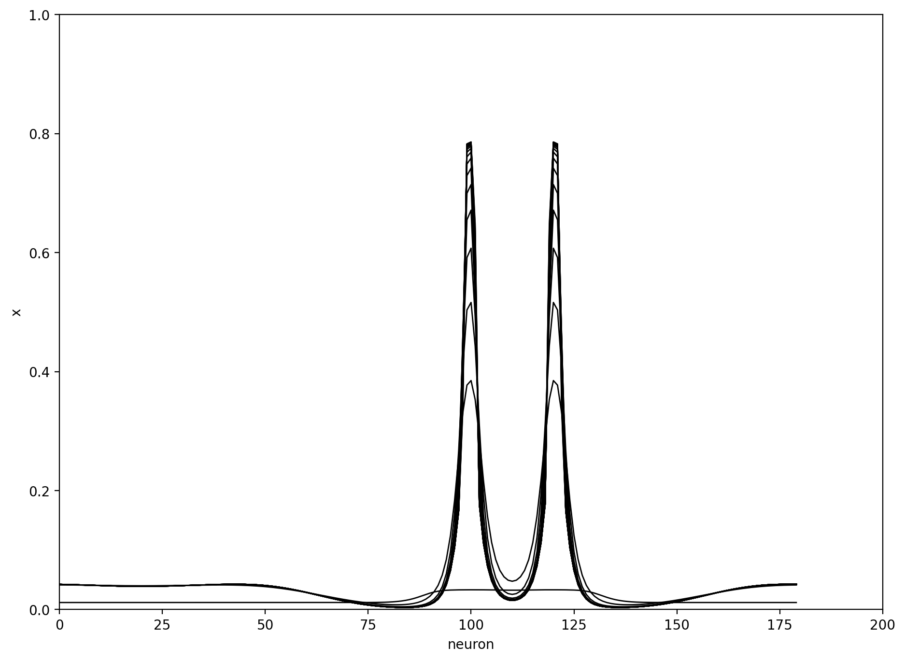
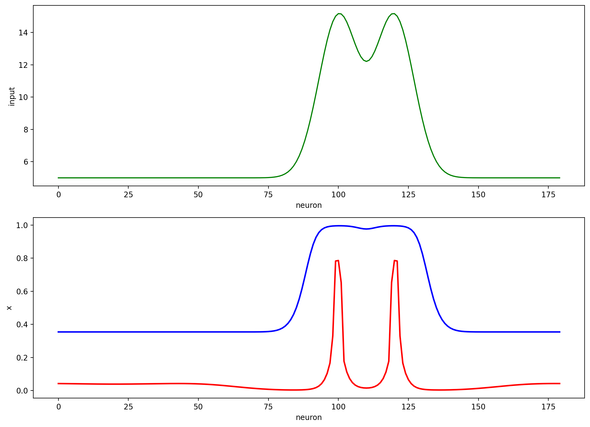

# Exercise 13 Report

## Objective
Simulate a competitive neural network with lateral inhibition in a 1D chain (`N=180`) and evaluate contrast enhancement / resolution effects.

## Model Used in Code
- Lateral interaction matrix:
  - `L[i,j] = -Lin0 * exp(-d(i,j)^2 / (2*sigin^2))`
  - `L[i,i] = Lex0` (self-excitation)
  - circular-distance option enabled.
- Neuron nonlinearity:
  - `sigmoid(x) = 1 / (1 + exp(-k*(x-x0)))`
- Dynamics (Euler):
  - `tmp = Ix + L*x - threshold`
  - `x[:,k+1] = x[:,k] + dt*( (1/tau) * (-x[:,k] + sigmoid(tmp)) )`

## Results
Temporal evolution of network activity:

Input profile and final competitive output vs feedforward-only output:

