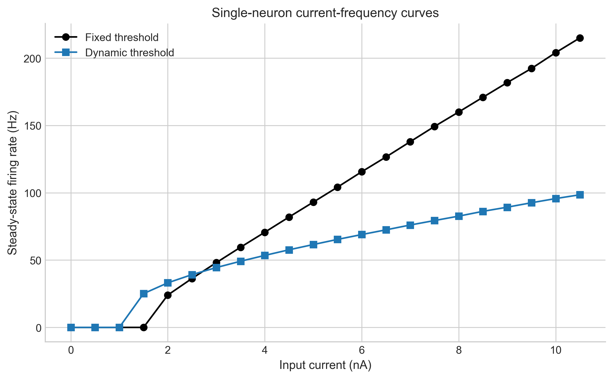
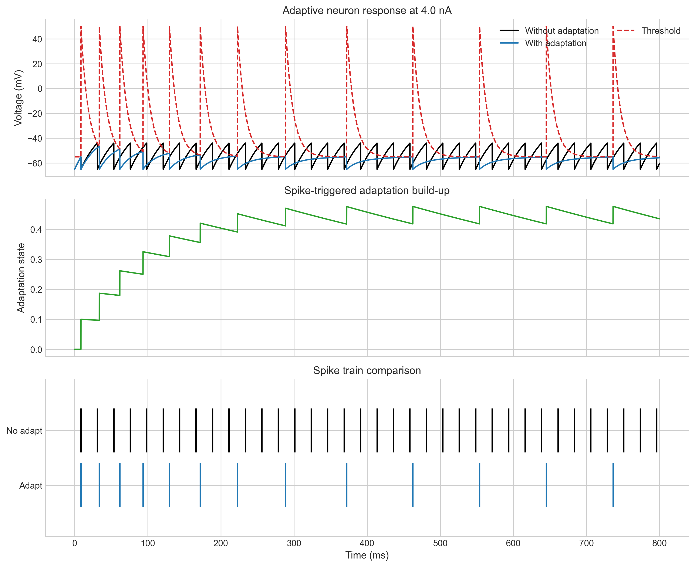
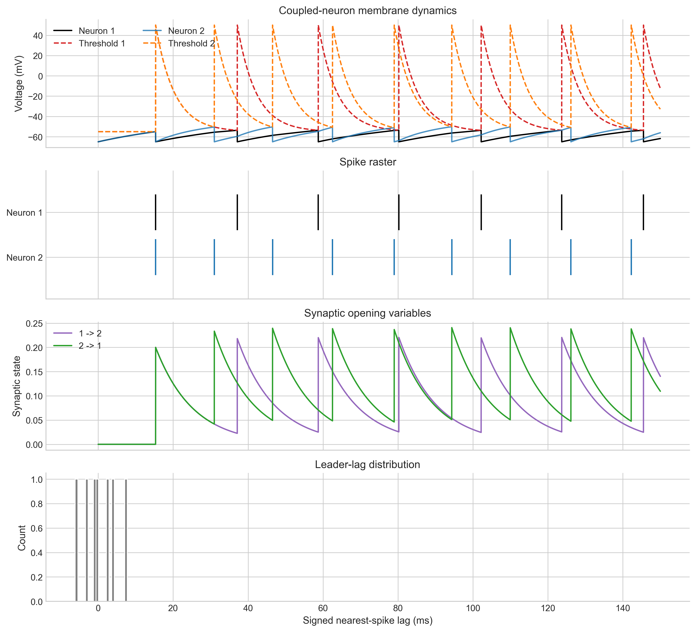
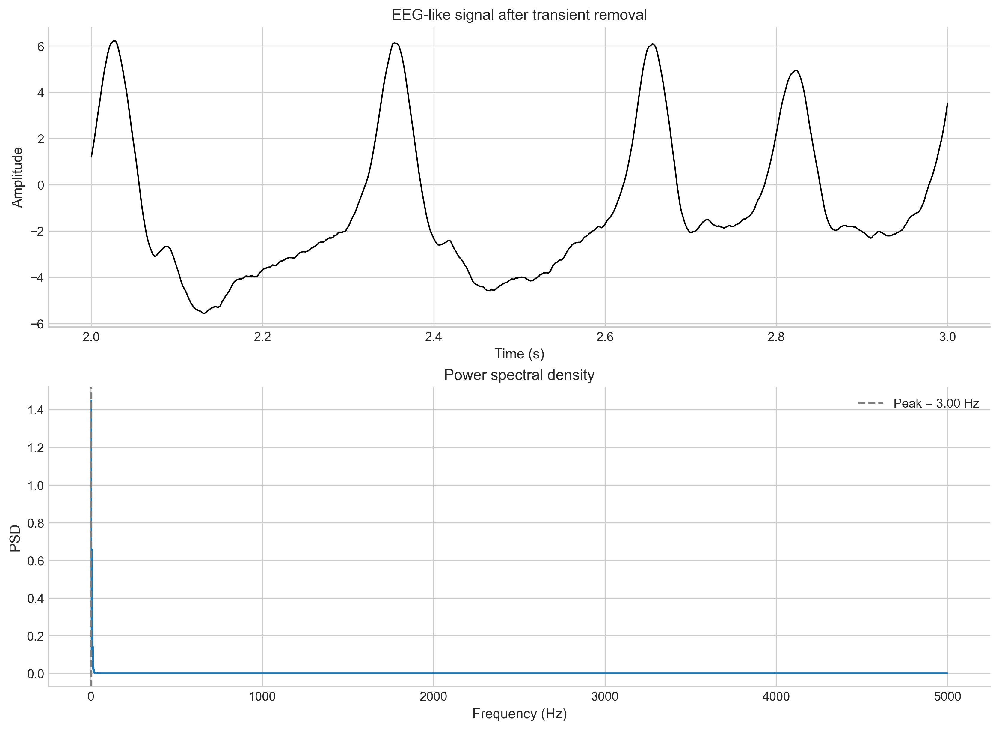

# Modeling Neural Dynamics from Single-Neuron Spiking to Population-Level EEG-like Activity

This repository is a reproducible computational neuroscience project that studies how simple dynamical models scale from single-neuron spike generation to population-level EEG-like activity. Rather than presenting isolated class exercises, it unifies four reduced models into one analysis pipeline that quantifies excitability, adaptation, synchrony, and spectral structure with rerunnable experiments and saved outputs.

The project refactors four original course modules into one coherent analysis pipeline:

- single-neuron integrate-and-fire excitability
- adaptive spiking dynamics with refractory threshold and slow conductance adaptation
- synchrony and leader-lag structure in a coupled two-neuron circuit
- spectral analysis of EEG-like activity in a Jansen-Rit neural mass model

## Project At A Glance

- **Scale progression:** single-neuron excitability -> spike-frequency adaptation -> coupled-neuron synchrony -> neural-mass oscillations
- **Implementation:** reusable Python package in `src/neural_dynamics/` with command-line experiments in `experiments/`
- **Outputs:** automatically generated figures plus CSV summaries in `results/metrics/`
- **Use case:** portfolio project for computational neuroscience, neural modeling, and reproducible scientific programming

## Scientific Motivation

Reduced neural models are useful when the goal is to interpret mechanisms rather than reproduce every biophysical detail. Here, the project asks a simple cross-scale question:

How do compact dynamical models explain the transition from input-driven single-neuron spiking to coordinated population rhythms?

The answer is developed in four steps:

1. A fixed-threshold and dynamic-threshold integrate-and-fire model quantify how input current maps to firing rate.
2. An adaptive neuron model shows how slow spike-triggered conductance reduces sustained excitability.
3. A conductance-coupled two-neuron system measures synchrony, lag structure, and correlation under asymmetric excitation and inhibition.
4. A Jansen-Rit neural mass model produces EEG-like activity whose dominant frequency and spectral power can be tracked under parameter changes.

## Key Results

All values below are generated from the current code in `results/metrics/project_summary.csv`.

| Analysis | Computed result | Why it matters |
| --- | --- | --- |
| Single-neuron excitability | Fixed-threshold rheobase: `2.0 nA`; dynamic-threshold rheobase: `1.5 nA` | Shows how threshold dynamics shift spike onset and effective excitability. |
| Threshold and adaptation effects | At `4.0 nA`, dynamic threshold lowers steady-state rate by `17.20 Hz` (`24.3%`), while slow adaptation lowers it by `33.49 Hz` (`75.4%`) | Quantifies two distinct mechanisms that reduce sustained firing under constant drive. |
| Coupled-neuron synchrony | Coincidence fraction increases from `0.286` to `0.571` as excitatory coupling is strengthened to ratio `3.0` | Demonstrates that even a two-neuron motif can show measurable synchrony sensitivity to synaptic parameters. |
| Neural-mass oscillations | Base PSD peak: `3.0 Hz`; peak power rises from `1.449` to `16.838` at `Wep = 160.0` | Connects population coupling changes to EEG-like rhythmic structure in the frequency domain. |

## Representative Figures

These figures are the most useful for quickly understanding the project.

<p align="center">
  
  
</p>
<p align="center">
  
  
</p>

- **Single-neuron f-I curve:** highlights the current-to-rate transformation and the effect of dynamic thresholding.
- **Adaptation dynamics:** makes the mechanism of spike-frequency adaptation visible in voltage, threshold, and adaptation state.
- **Coupled-neuron dynamics:** shows how asymmetric coupling shapes timing, spike trains, and synaptic state variables.
- **Neural-mass signal and PSD:** links time-domain EEG-like activity to a measurable dominant oscillation frequency.

## Repository Structure

```text
README.md
pyproject.toml
src/
  neural_dynamics/
experiments/
results/
  metrics/
  manifests/
figures/
  single_neuron/
  adaptation/
  coupled/
  neural_mass/
tests/
additional_modules/
```

## Installation

Create a virtual environment, activate it, and install the project:

```bash
python -m venv .venv
. .venv/bin/activate
pip install -e .[dev]
```

On Windows PowerShell:

```powershell
python -m venv .venv
.venv\Scripts\Activate.ps1
pip install -e .[dev]
```

## How To Run

Run the full pipeline:

```bash
python experiments/run_all.py
```

Run individual analyses:

```bash
python experiments/single_neuron_fi.py
python experiments/adaptation_analysis.py
python experiments/coupled_synchrony.py
python experiments/neural_mass_spectral_analysis.py
```

Run tests:

```bash
pytest -q
```

## Outputs

Each experiment writes:

- figures to `figures/<experiment>/`
- CSV metrics to `results/metrics/`
- file manifests to `results/manifests/`

The most useful summary file for CV writing and reporting is:

- [results/metrics/project_summary.csv](results/metrics/project_summary.csv)

## Main Methods

### 1. Single-Neuron Excitability

The project compares fixed-threshold and dynamic-threshold integrate-and-fire neurons using exact exponential voltage updates and current sweeps. The main quantitative output is the firing-rate versus current relationship.

### 2. Adaptation Analysis

The adaptive neuron adds a slow spike-triggered conductance with a hyperpolarized reversal potential. The analysis measures how adaptation changes steady-state firing rate, ISIs, and adaptation build-up under sustained current.

### 3. Coupled-Neuron Synchrony

Two neurons interact through asymmetric conductance-based synapses. The analysis measures spike coincidence, signed lag, firing-rate changes, and membrane correlation while sweeping excitatory coupling strength.

### 4. Neural-Mass Spectral Analysis

A Jansen-Rit neural mass model is simulated under reproducible noisy drive. After transient removal, a Welch-style PSD is computed to estimate the dominant oscillation frequency and spectral peak power.

## Limitations

- These are reduced models intended for interpretability, not detailed biophysical reconstruction.
- The coupled-neuron analysis uses a two-neuron motif, so conclusions about network synchrony should stay local and mechanistic.
- The neural mass regime used here produces low-frequency EEG-like rhythms in the current parameter range; it is not tuned to match a specific experimental dataset.
- Parameter sweeps are intentionally lightweight and meant to show sensitivity, not exhaustive model fitting.

## Future Work

- Add larger parameter sweeps with command-line configuration files.
- Extend the coupled-neuron study to small recurrent networks with richer synchrony measures.
- Compare neural-mass outputs across parameter regimes associated with alpha-like and beta-like activity.
- Link spike-based and neural-mass analyses more directly through population statistics or coarse-graining experiments.

## Secondary Material

Additional coursework modules are preserved under [additional_modules](additional_modules) but are not part of the main project framing.
