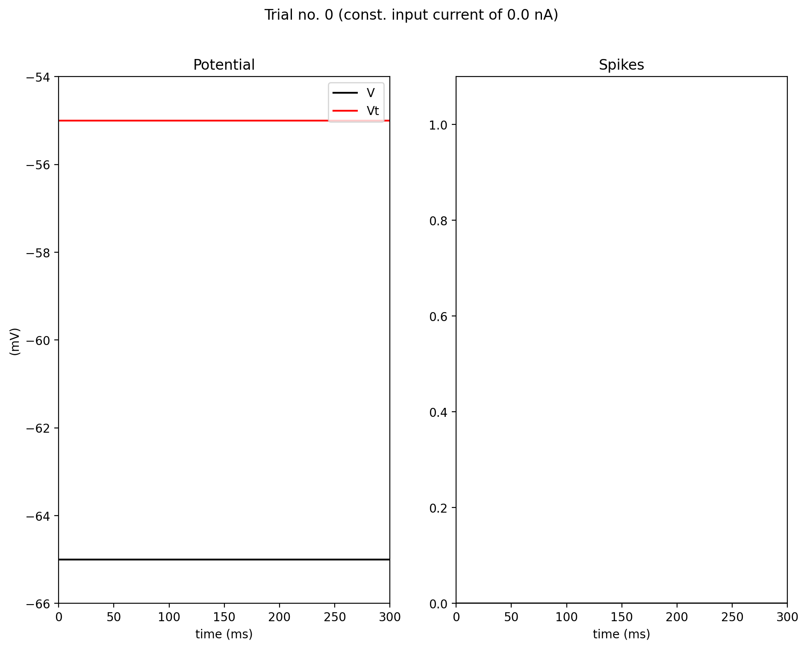
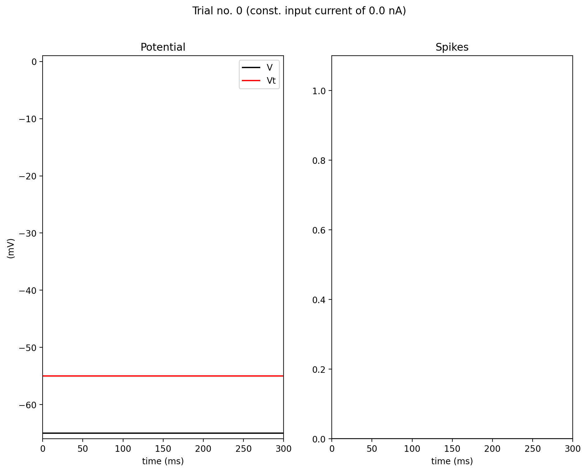

# Exercise 01 and 02 Report

## Folder contents
- `exercises01_02.py`: original Python code (copied here).
- `run_exercises01_02.py`: headless runner used to execute the script and save figures.
- `figures/`: generated plots.
- `figures_manifest.json`: list of all generated figure files.

## Execution
Command used:

```powershell
python .\run_exercises01_02.py
```

Result:
- `50` figures were generated and saved in `figures/` as `fig_001.png` ... `fig_050.png`.

## Exercise 1 (constant threshold)
### Input current


### Membrane potential


### Spike train


### Example trial (constant current)


### Current-frequency curve


## Exercise 2 (variable threshold)
### Single-current response


### Example trial (constant current)


### Current-frequency curve


## Notes
- Trial-by-trial figures are included in `fig_004.png` to `fig_025.png` (Exercise 1) and `fig_028.png` to `fig_049.png` (Exercise 2).
- All images are saved as PNG with `dpi=200`.
