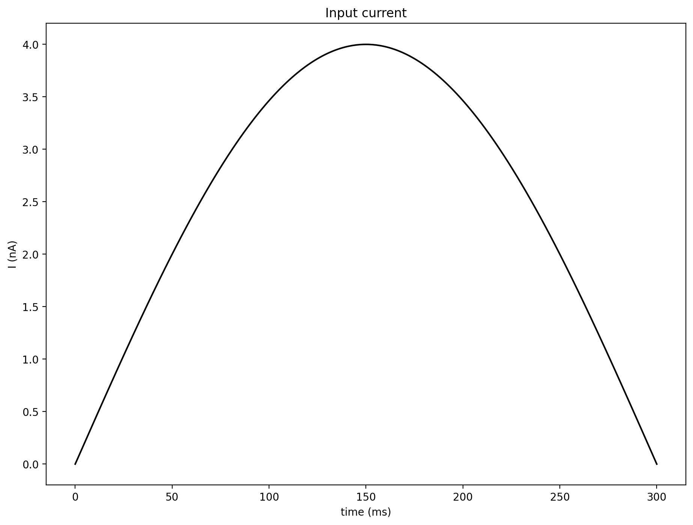
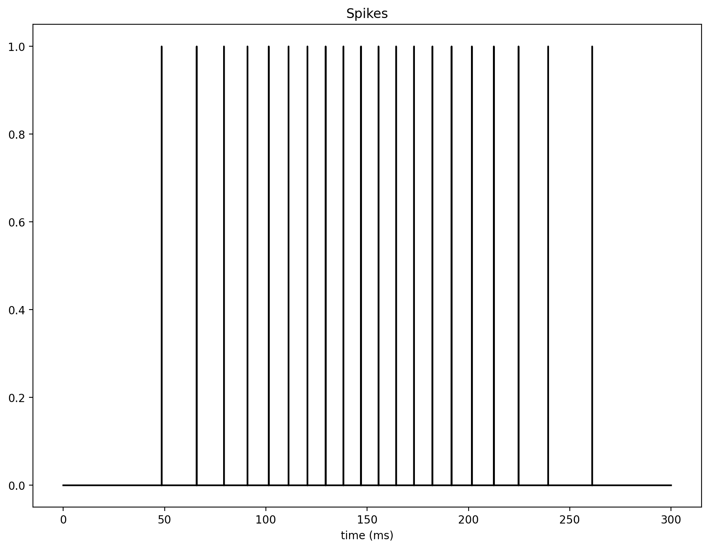
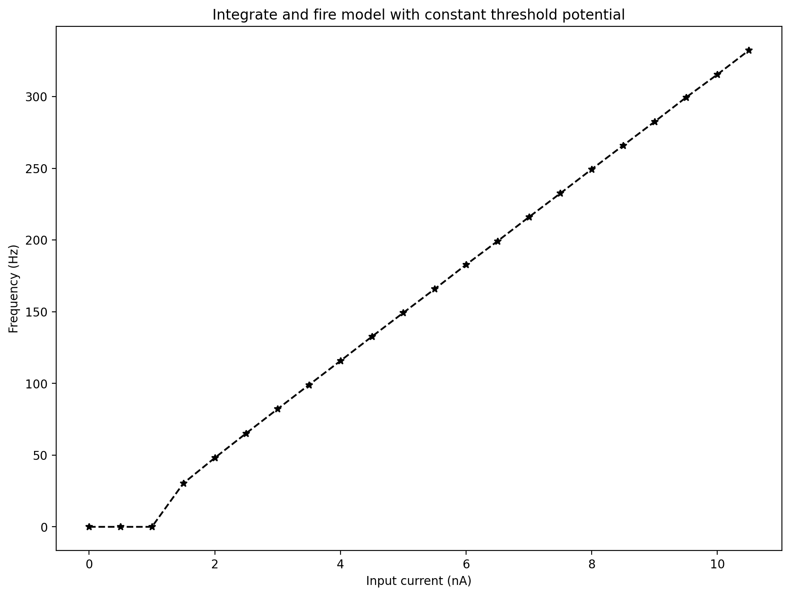
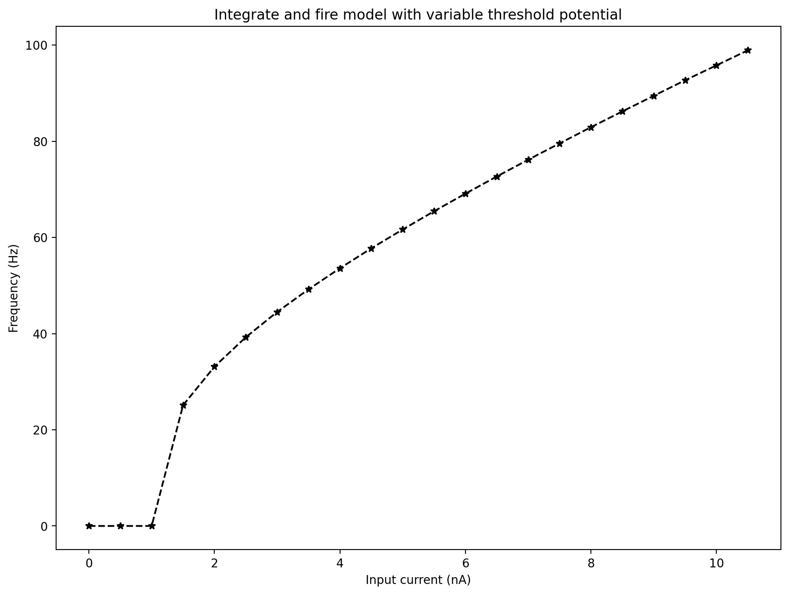

# Integrate-and-Fire Neuron Report (Exercises 1 and 2)

## Exercise 1: Constant Threshold Integrate-and-Fire

### Objective
Simulate a single integrate-and-fire neuron with fixed threshold and analyze:
1. Time response to a variable input current.
2. Discharge frequency as a function of constant input current (I-F curve).

### Model
Membrane dynamics:

\[
\tau_m \frac{dV}{dt} = -\left(V - E_0\right) + r I(t)
\]

Spike rule:
- If \(V \ge V_{th}\), emit a spike and reset \(V \leftarrow E_0\).

Used parameters (from the provided code):
- \(E_0 = V_{reset} = -65\) mV
- \(V_{th} = -55\) mV
- \(\tau_m = 30\) ms
- \(r = 10\) M\(\Omega\)

### Results
Input current \(I(t)\) was chosen as a rectified sinusoid.

Membrane potential follows the input and resets at each threshold crossing.

Binary spike train generated by threshold crossings:

Frequency-current behavior (constant currents from 0 to 10.5 nA):

Interpretation:
- For low current, spiking is absent or rare.
- Increasing current increases firing rate, giving the expected monotonic I-F relationship for a basic LIF neuron.

## Exercise 2: Variable Threshold (Relative Refractory Effect)

### Objective
Extend Exercise 1 by making threshold dynamic to model relative refractoriness, then evaluate:
1. Response to one constant input current.
2. I-F curve across a range of constant currents.

### Model
Membrane dynamics:

\[
\tau_m \frac{dV}{dt} = -\left(V - E_0\right) + r I
\]

Threshold dynamics:

\[
\tau_t \frac{dV_t}{dt} = -\left(V_t - V_{tL}\right)
\]

Spike rule:
- If \(V \ge V_t\), emit spike, reset \(V \leftarrow E_0\), and set \(V_t \leftarrow V_{tH}\).

Used parameters:
- \(E_0 = -65\) mV
- \(V_{tL} = -55\) mV
- \(V_{tH} = 0\) mV
- \(\tau_m = 30\) ms
- \(\tau_t = 10\) ms
- \(r = 10\) M\(\Omega\)

### Results
Example response for one constant current:

Here, the threshold rises after each spike and then decays back to \(V_{tL}\), which temporarily reduces excitability (relative refractory period).

Frequency-current curve:

Interpretation:
- The neuron still shows increasing firing rate with current.
- Compared with fixed threshold, dynamic threshold introduces adaptation-like behavior by spacing spikes more after each reset.

## Conclusion
Exercise 1 demonstrates the standard LIF mechanism with fixed threshold and monotonic I-F response.  
Exercise 2 adds a dynamic threshold that captures relative refractory effects, producing a more physiologically realistic spiking pattern while preserving the overall increase of frequency with input current.
