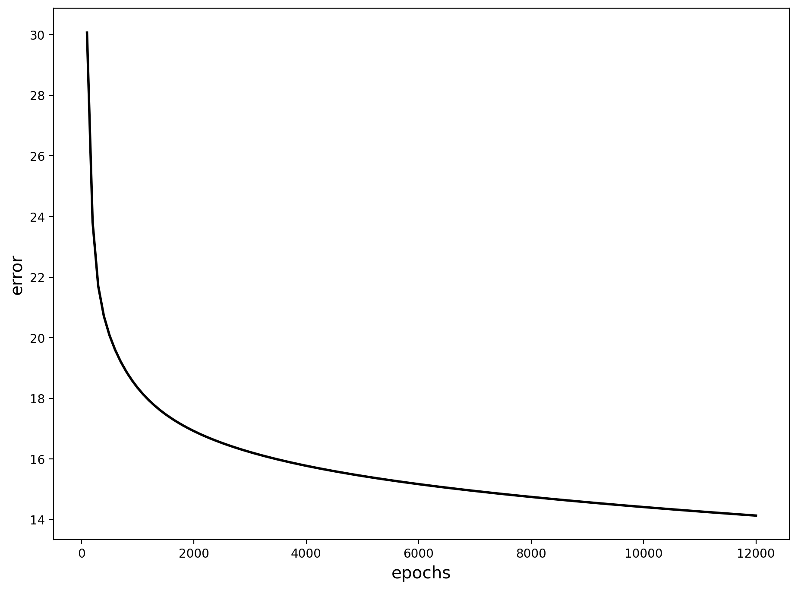

# Exercise 10 Report

## Objective
Train a two-layer neural network (2 hidden neurons + 1 output neuron) to model chemoreceptor frequency (`fac`) from `Pao2` and `Paco2`.

## Model Used in Code
- Hidden/output activation:
  - `sigmoid(u) = 20 / (1 + exp(-u/10))`
- Forward:
  - `u1 = W1o*Pao2 + W1c*Paco2 - teta1`
  - `u2 = W2o*Pao2 + W2c*Paco2 - teta2`
  - `usc = sigmoid(Wu1*y1 + Wu2*y2 - tetau)`
- Error:
  - `E = fac - usc`
- Backprop updates for all weights and thresholds.

Run note:
- Iterations were capped via `EX10_MAX_STEPS=12000` for practical runtime.

## Results
Training error over epochs:

Predicted vs experimental examples:

Generalization checks (vary Paco2 / vary Pao2):

